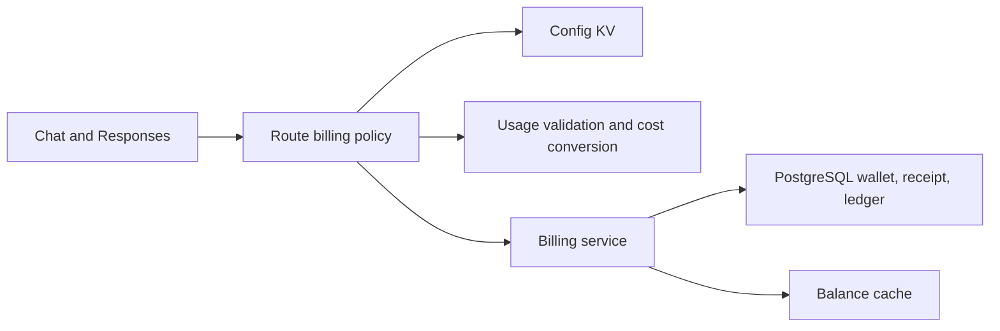
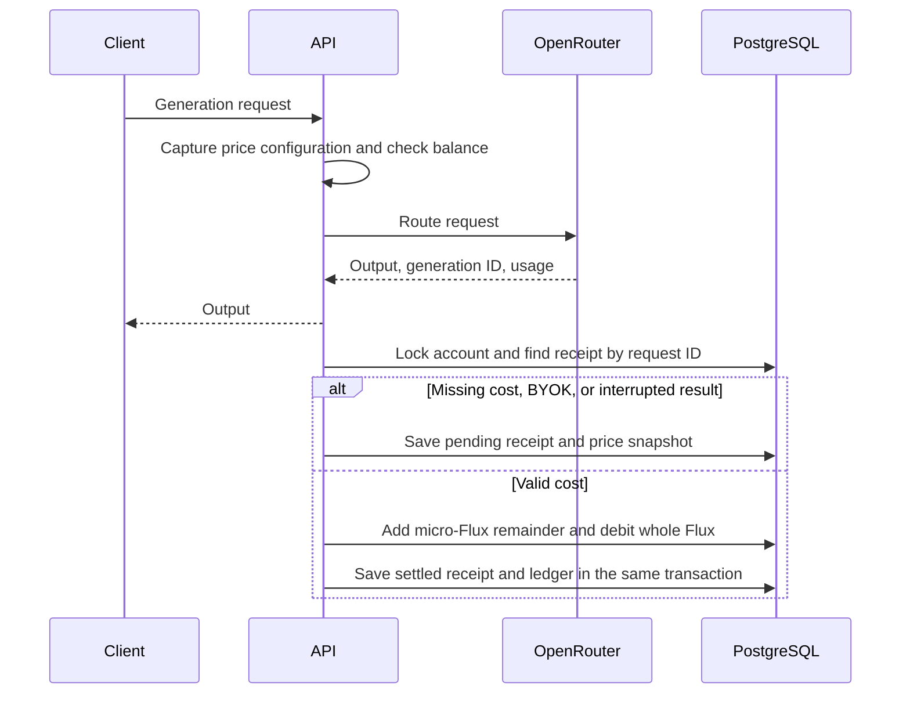

# OpenRouter cost billing

Status: accepted for a local implementation. Production prices and rollout are not approved.

## Decision

For OpenRouter credit requests, use `usage.cost` in USD as the charge basis.
Multiply this cost by configured `fluxPerUsd` and `multiplier` values.
Do not apply another cache discount. OpenRouter already includes cache pricing in the cost.

The optional `OPENROUTER_COST_BILLING` configuration enables this policy only for the resolved `openrouter.ai` provider.
Other providers use the existing token or request policy.
The configuration has no default prices. Each request captures its configuration before routing.

## Current behavior

The token policy adds input and output tokens, multiplies by `FLUX_PER_1K_TOKENS`, and rounds up to at least one Flux.
Missing token usage selects `FLUX_PER_REQUEST`. Schema defaults are one Flux per thousand tokens and five Flux per request.
Authorization checks the request-rate balance before routing. It does not reserve funds.
Settlement drains a partial balance and records the unpaid amount.
An interrupted stream does not currently debit Flux.

## Scope

Chat Completions and Responses both retain the provider usage and generation ID.
Chat streaming uses complete SSE frames, not a fixed tail buffer, to collect usage.
An explicit zero cost settles at zero. Missing, invalid, BYOK, and interrupted receipts remain pending in PostgreSQL.
Pending receipts never select the token price. A pending receipt is not a free request.
The service supports settlement of a pending receipt with recovered usage and its original price snapshot.
Automatic generation lookup, reconciliation jobs, and operator UI are outside this first version.
Automatic lookup belongs to phase two. Phase one leaves pending rows uncharged and uses receipt reports to assess the loss.
This is an accepted product tradeoff, not a claim that pending receipts are free or already reconciled.
Structured logs record settlement, pending reasons, and persistence failures without request bodies or credentials.
The README includes read-only queries for pending rates, missing IDs, and unpaid whole Flux.
Database failures and process crashes can leave no receipt. Runtime error logs remain necessary and do not guarantee recovery.

Each cost is rounded up to a micro-Flux with decimal arithmetic.
One Flux equals 1,000,000 micro-Flux. Each account retains the remainder in PostgreSQL without an expiry.
Whole Flux charges use the existing wallet and ledger units. This avoids a change to payment and client contracts.
The account row lock serializes remainder updates. The request ID prevents repeated settlement.
The receipt, remainder, balance, and ledger update share one transaction.
Zero charges also create ledger records so they have an audit trail.

The preflight balance rule remains in force. This version does not reserve the maximum generation cost.
Upstream failures and automatic retry attempts are not billed as separate user requests.

## Module dependencies



## Affected files

```text
server/apps/api/
  src/services/adapters/config-kv/definitions.ts
  src/services/domain/flux.ts
  src/services/domain/billing/
    billing.ts
    billing-service.ts
    tests/
  src/routes/openai/v1/
    middlewares/billing.ts
    operations/chat-completions/index.ts
    operations/responses/index.ts
    route.test.ts
  src/schemas/
    flux.ts
    llm-cost-receipt.ts
    index.ts
  drizzle/
```

## Sequence



## Test plan

- Check exact decimal conversion, zero, invalid cost, and BYOK classification.
- Check both protocols with JSON and SSE responses, including split frames and trailing events.
- Check pending receipts and zero-cost records in a real PGlite database.
- Check repeated requests, concurrent charges, remainder carry, and partial balances.
- Check the migration against an existing integer wallet.
- Run focused route, billing, configuration tests, typecheck, and lint.
- Production OpenRouter calls, production database changes, and a price rollout are not part of local verification.
