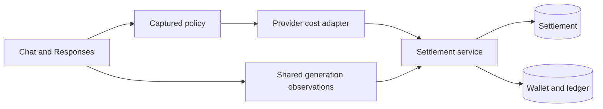
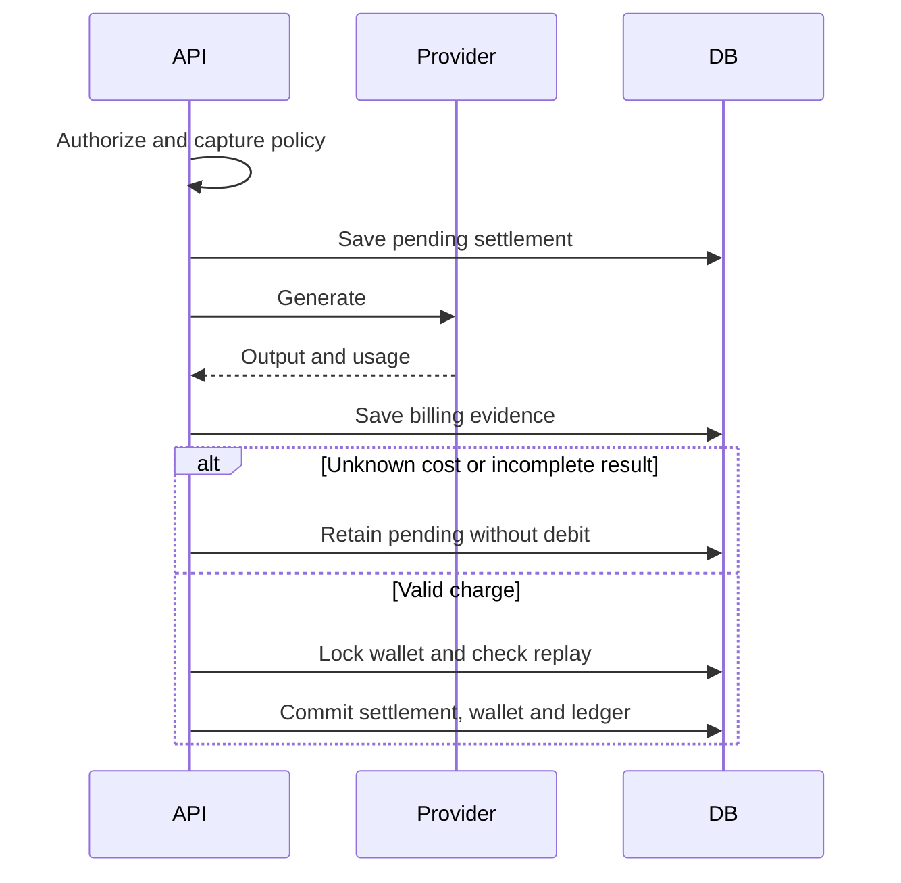

# Provider-neutral LLM cost settlement

Date: 2026-09-23, revised 2026-09-27
Status: accepted

## Decision and scope

Keep billing and request tracking in separate pull requests.
This change owns pricing policy, settlement evidence, wallet accounting, and ledger correlation.
The tracking change depends on this change but billing does not depend on tracking tables or APIs.
The shared generation observation contract validates billing evidence without importing a diagnostic service.

Provider-cost pricing is opt-in through `LLM_COST_BILLING`.
OpenRouter is the first adapter, selected from the trusted routed hostname.
Other providers retain token or per-request pricing.
Missing or invalid cost, BYOK, and interrupted results stay pending without cost-to-token fallback.
Do not infer zero cost from missing evidence.

## Storage and transactions

`llm_request_settlement` owns the price snapshot, pending state, cost evidence and charged Flux.
`flux_transaction` owns posted balance changes and settlement/operation correlation.
`user_flux` owns whole Flux and fractional cost carry.
Existing `llm_request_log` remains unchanged. No attempt table or request-query API is added here.

After authorization and alias resolution, save the pending settlement before dispatch.
Capture the policy before the call. Reconciliation reuses that policy.
Save recovered billing evidence before the balance transaction so a failed debit retains pending evidence.
Lock the wallet before checking settlement replay. Wallet, remainder, ledger and settled state commit together.
A settled request cannot be charged again; provider and generation identity changes are rejected.
An initial operation uses `llm:<settlement-id>:initial`. Future adjustments need distinct operation IDs and request IDs.
Redis remains a best-effort balance cache.

Cost pricing multiplies USD cost by configured `fluxPerUsd` and `multiplier`.
Round up to micro-Flux, then carry fractions in the wallet. One Flux is 1,000,000 micro-Flux.
An explicit zero cost remains zero. Partial balances record requested and actual charged Flux.

## Architecture





Affected files:

```text
server/apps/api/
  src/schemas/{flux,flux-transaction,llm-request-settlement}.ts
  src/services/domain/generation-observation.ts
  src/services/domain/billing/
  src/services/adapters/llm/cost.ts
  src/routes/openai/v1/{middlewares,operations}/
  drizzle/0026_llm_cost_settlement.sql
```

## Compatibility and rollout

Apply `0026_llm_cost_settlement.sql` before deploying, even when cost pricing is disabled.
Keep main's 0025 migration and snapshot unchanged.
The migration creates settlement storage and adds wallet/ledger fields. It does not change historical balances or request-log columns.
No historical prices or settlements are invented.
This replaces unpublished earlier PR drafts; it is not an upgrade from an already applied draft.
Keep accounting columns and fractional remainders on rollback.
TTS, ASR, payment policies and whole Flux units stay unchanged.

## Boundaries and non-goals

Pending settlement persistence is required before dispatch. Disabling cost pricing does not remove that database dependency.
Preflight still checks the request-rate balance; it does not reserve maximum generation cost.
A new HTTP retry creates a new request ID. Settlement replay is not HTTP request deduplication.
Chat forwards raw SSE bytes, including comments, and removes upstream Content-Length.
A crash can leave no generation ID. Automatic lookup, reconciliation workers, refunds and operator UI are not included.
Request/attempt tracking, diagnostic lifecycle, retention jobs and Activity APIs belong to the dependent tracking PR.
Billing evidence has independent retention and cannot be deleted with diagnostic logs.
Sparse provider evidence is bounded to 16,384 JSON characters, with common credential/content keys removed recursively.

## Verification plan

- Verify normalized cost conversion, zero cost, cache reporting, BYOK and invalid/missing usage.
- Exercise JSON/SSE through real routes with injected upstream responses and PGlite.
- Verify saved authorization policy, provider/generation identity, replay and concurrent wallet updates.
- Verify rollback preserves pending evidence without changing balance or remainder.
- Verify existing token/request policies, TTS/ASR policies and ledger behavior.
- Apply migration to historical wallet/ledger fixtures and verify unchanged balances and old-writer inserts.
- Run workspace typecheck and lint. Live provider and production database behavior remain unverified.
