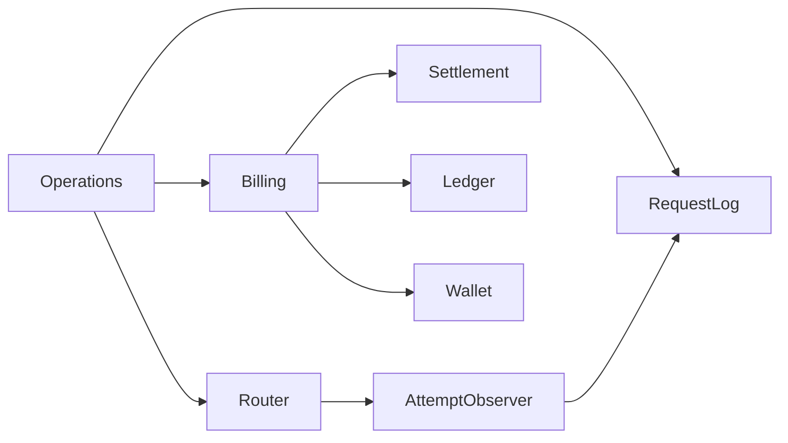
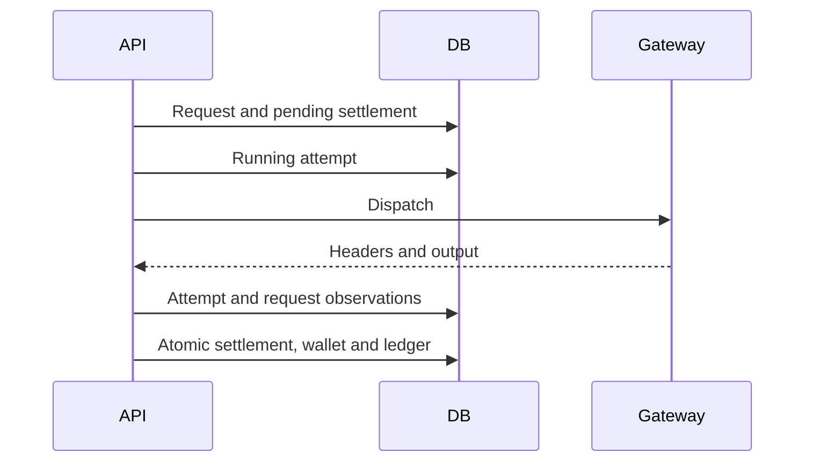

# Provider cost billing and request accounting

Date: 2026-09-23, revised 2026-09-27
Status: accepted

## Decision

Use normalized provider-reported USD cost as an optional Flux charge basis.
Keep provider parsing in adapters. The settlement service receives a provider ID, cost, and price snapshot.
Only the OpenRouter cost adapter ships now. It maps the trusted router hostname `openrouter.ai` to `openrouter`.
Do not select a billing adapter from a client field or the provider name in a response.
OpenRouter credit requests use `usage.cost`; do not apply another cache discount.
BYOK usage remains pending because its reported charge can exclude upstream inference cost.

Separate request facts, upstream attempts, and settlement evidence.
`llm_request_log` owns request outcomes. `llm_request_attempt` owns each local upstream dispatch.
`llm_request_settlement` owns pending state, prices, cost evidence, and charged Flux.
`flux_transaction` owns posted balance changes. `user_flux` owns the balance and fractional remainder.
Settlement records survive diagnostic-log deletion. No accounting foreign key cascades from request logs.
Store bounded, versioned JSON for optional dimensions and provider evidence. Never store credentials or message content.

## Tracking boundary

Persist a request and pending settlement before dispatch for authorized, resolved Chat and Responses calls.
Persist each attempt before sending it. An HTTP success only means headers arrived; request finalization records the body outcome.
Local attempts do not describe retries hidden inside a gateway.
Stale running records become unknown, not failed or free. Recovery must not resend model requests.
Automatic provider lookup and full payload storage are not part of this version.
The settlement replay entry point accepts recovered evidence without overwriting the original pricing policy.

Module dependencies:



Affected files:

```text
server/apps/api/
  src/schemas/llm-request-{log,attempt,settlement}.ts
  src/schemas/flux-transaction.ts
  src/services/domain/request-log.ts
  src/services/domain/llm-router/{router,types}.ts
  src/services/domain/billing/billing-service.ts
  src/routes/openai/v1/{model-routing,middlewares/billing,operations}/
  drizzle/0026_llm_request_accounting.sql
```



Test plan: real database ownership, idempotent replay, pending recovery, attempt isolation,
router fallback, stream interruption, historical-row migration, and unchanged wallet totals.

## Pricing and scope

`LLM_COST_BILLING` maps provider IDs to positive `fluxPerUsd` and `multiplier` values, with no default prices.
Each request captures this configuration before routing. Providers without both an adapter and prices keep the token or request policy.
Cost equals USD cost multiplied by both factors. Decimal arithmetic rounds up to a micro-Flux, not a whole Flux.
One Flux equals 1,000,000 micro-Flux. The wallet retains the fractional remainder without an expiry.
Whole Flux charges, top-up values, and client balance units stay unchanged. Explicit zero cost settles at zero.

Chat Completions and Responses support JSON and SSE accounting.
Chat forwards original SSE bytes, including comments, while observing a bounded parsed copy.
Missing or invalid cost, unsupported cost basis, and interrupted results persist as pending without token fallback.
Pending requests do not change the wallet or fractional remainder.
Settlement with recovered usage reuses the original price snapshot and rejects provider or generation ID changes.
Automatic generation lookup, background reconciliation, and an operator interface remain phase two.
Pending rows remain uncharged until an explicit settlement occurs.

Authorization still checks the request-rate balance; it does not reserve funds.
Partial balances drain to zero and retain requested versus charged whole Flux.
Upstream retries are not separate user charges. A new HTTP request gets a new server request ID.
Database failures or process crashes can leave no cost evidence. Runtime errors do not guarantee recovery.
Authorized, resolved requests are journaled before dispatch. This does not reserve funds or provide strict prepaid limits.

## Request facts and gateway extensions

Store separate identities for the routed gateway hostname, reported inference provider, and trusted billing adapter.
Store the requested alias, selected route model, dispatched upstream model, and returned model separately.
Preserve request, generation, and session IDs; protocol; stream mode; outcome; duration; and first output timing.
Router counters describe the selected alias candidate. They are not a complete per-attempt trace across alias fallback.

Queryable token columns include totals, cache reads, cache writes, and reasoning tokens.
`provider_usage` retains unknown gateway-specific meters and malformed cost evidence.
Common credential and content keys are removed recursively. Evidence over 16,384 JSON characters becomes an explicit omission marker.
This is bounded operational metadata, not a general-purpose payload archive.
`provider_metadata` carries selected response metadata such as service tier, fingerprint, and upstream IDs.
Additional safe accounting facts can use JSON metadata without another migration.
Do not persist prompt or completion bodies, authorization headers, API keys, or credential-bearing URLs in these fields.
Optional malformed metadata must not invalidate otherwise valid cost or token accounting.
Missing facts stay unknown. Do not infer an upstream provider from the model author.

This version captures request-path data, not all fields from a gateway's separate generation lookup API.
For example, OpenRouter's generation endpoint can report upstream IDs, native token counts, provider responses, and generation time.
Adding a lookup adapter can enrich observations later; it must not overwrite a settled charge.
The public references are [usage accounting](https://openrouter.ai/docs/cookbook/administration/usage-accounting)
and [generation details](https://openrouter.ai/docs/api/api-reference/generations/get-generation).
Owner-scoped list and detail APIs are available at `/api/v1/llm-requests`. They omit raw evidence, credential references, and internal prices.
No Activity UI or full Agent Trace is included.

## Transaction and write ownership

The account row lock serializes remainder updates. Read the settlement row after taking that lock.
An already settled request returns its charged amount without another ledger entry.
Settlement uses a unique `(user_id, request_id)` key. Ledger rows also carry a settlement ID and an operation ID.
The initial operation is `llm:<settlement-id>:initial`. Future adjustments need distinct operation and request IDs.
New historical-style observations without a request ID remain append-only.
Save pending evidence before the balance transaction. A ledger failure leaves the evidence pending.
The wallet, remainder, ledger, and settled settlement row commit in one transaction, including zero cost charges.
Observation writes cannot update settlement evidence. A summary charge is a projection, not the billing source of truth.
Reconciliation preserves the original request outcome and timing rather than recording the reconciliation time as generation time.
Redis remains a best-effort balance cache updated after commit.

## Migration and compatibility

`0026_llm_request_accounting` follows the unchanged main-branch `0025_premium_frog_thor` migration and snapshot.
It adds nullable columns and indexes to `llm_request_log`, plus a zero-default `user_flux.llm_cost_remainder`.
It creates the attempt and settlement tables and extends the ledger with correlation keys.
It does not modify historical request amounts, wallet balances, or provider configurations.
Historical observations have no invented attempts, prices, or settlements. Their new lifecycle fields remain null.
This migration replaces the unpublished local 0026 draft. It is not an upgrade from an already applied draft.
Existing rows retain null new fields, including request IDs, and old writers can still insert their original columns.
Apply the migration before deploying the new API, even when cost pricing is disabled.
Enable cost pricing only after all API instances run the new version.
Retain the new columns on application rollback so accounting evidence and fractional charges survive.
TTS, ASR, and payment charging policies stay unchanged.

## Verification

- Validate cost conversion, zero charges, pending usage, BYOK restrictions, and other normalized providers.
- Exercise JSON and SSE through real route handlers and PGlite persistence for both protocols.
- Test gateway/upstream/model identities, cache and reasoning fields, and unknown usage meters.
- Test delayed observations, observation-before-settlement, pending reconciliation, and cross-generation replay.
- Verify concurrent charges, fractional carry, partial balances, idempotency, and rollback on ledger failure.
- Apply the migration to populated old tables and confirm old writers, historical rows, and snapshot continuity.
- Run API and workspace typechecks, focused tests, and lint.
- Production calls, database migration, pricing rollout, and Activity UI acceptance are separate validation steps.

## Recovery and retention

`recoverStaleRequests(before)` is an explicit operator service entry point, not an automatic scheduler.
Use a cutoff older than the longest allowed request. It marks unfinished observations unknown without a fabricated end time.
It never sends a model request or charges a wallet. Pending settlement remains available for explicit reconciliation.
Generation lookup, automatic retries, refunds, and diagnostic retention jobs need separate operational policy.
A process crash before a generation ID is saved can prevent provider lookup. Do not infer zero cost.
Do not cascade diagnostic deletion into settlement or ledger tables.
Pricing, evidence, and the original model survive there for billing review.

## Extension policy

Stable identity, state, time, and correlation use columns. Sparse provider facts use bounded JSON.
New business dimensions belong to a validated dimensions contract. Promote frequent filters to indexed columns when needed.
Each new table carries a schema version. Unknown values remain null, not zero.
No content, aggregate, trace-span, or duplicate provider-configuration tables are created in this version.
