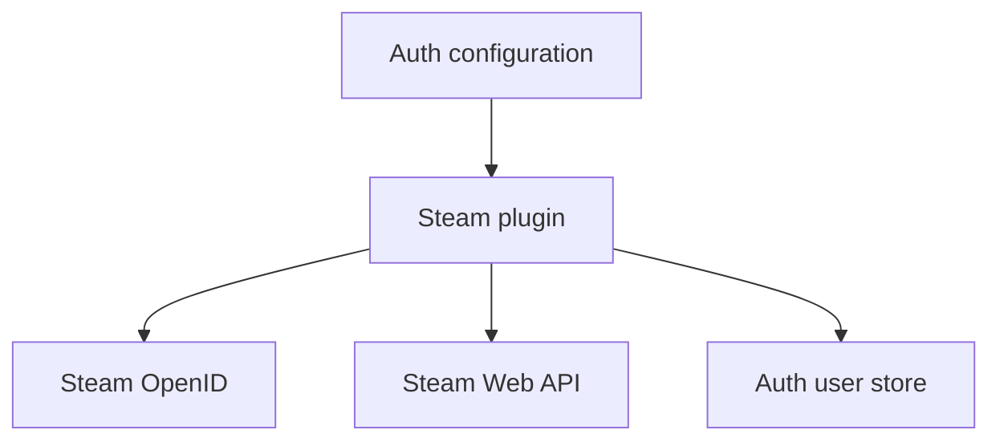
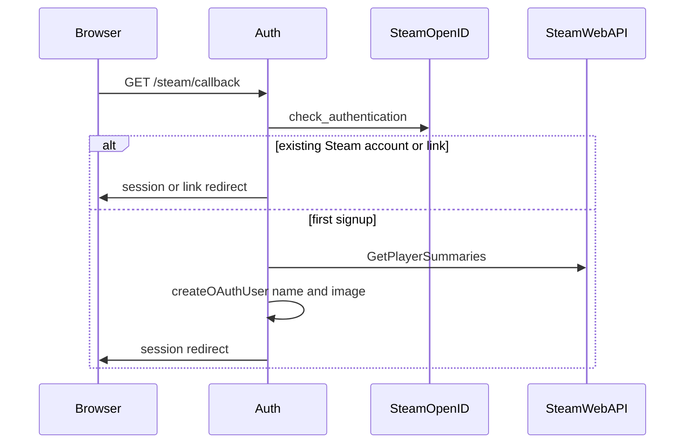

# Steam profile on first sign-up

Status: accepted

## Decision

Steam OpenID returns a SteamID64 only.
Auth reads the Steam profile when it creates a new Steam user.
The read uses Steam Web API `GetPlayerSummaries`.
`personaname` becomes `user.name` after trim, when the value is not empty.
An `avatarfull` value becomes `user.image` when it is an https URL.
Auth does not download the avatar file.

`STEAM_PUBLISHER_KEY` is optional and defaults to an empty string.
An empty key skips the profile read.
The new user then keeps the name `Steam User {SteamID64}`.
`user.image` stays empty.
A timeout, HTTP error, invalid body, empty player list, or unusable field uses the same result.
The sign-in still creates the user and the session.

The publisher key is the `key` query parameter.
ofetch includes the full URL in a failed request error.
Auth removes that URL before it writes a log.
The key does not enter the browser redirect, the session, or the user JSON.
Auth does not store the publisher key or the raw response.

A later sign-in does not read the profile again.
Linking Steam to an existing user does not read the profile.
That link does not change `name` or `image`.
Auth does not backfill users that already exist.

## Non-goals

No database migration.
No profile refresh after the first sign-up.
No storage of the API key or the raw Steam response.
No change to OpenID verification.

## Module dependencies



## Affected files

```text
server/apps/auth/src/
  auth.ts
  env.ts
  plugins/steam.ts
  tests/env.test.ts
  tests/steam.test.ts
server/apps/auth/README.md
server/docs/ai/adr/2026-09-23-steam-signup-profile.md
```

## Sign-up sequence



## Verification

Run the Auth Steam plugin tests and the Auth environment tests.
The first callback stores the persona name and the avatar URL.
A failed profile read still creates the user with the placeholder name.
A second sign-in and a link do not call `GetPlayerSummaries`.
The default key is an empty string.
