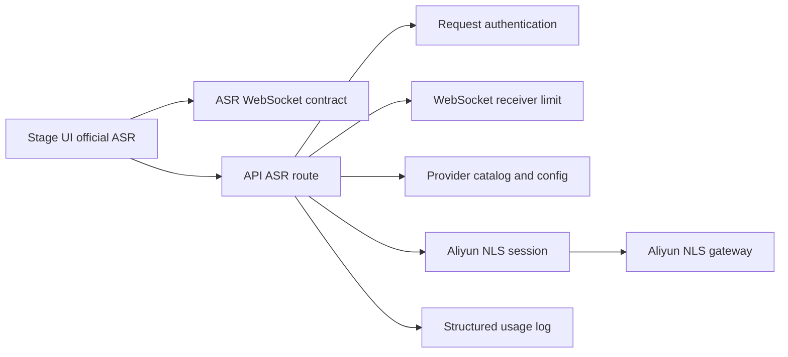
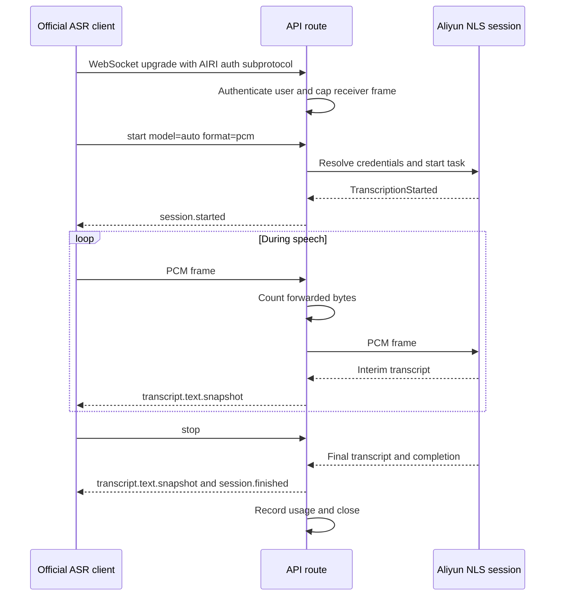

# Official ASR over an authenticated WebSocket

Status: accepted

## Context

The prior official ASR route used a streaming HTTP upload and an SSE response.
Browser clients cannot read the response before the upload ends on every target.
The official provider needs transcript updates while microphone audio is still
arriving.

Aliyun NLS already uses a WebSocket protocol. That protocol contains Aliyun
task identifiers and credentials. AIRI clients must not depend on it.

## Decision

Use `/api/v1/audio/transcriptions/ws` for official real-time ASR. The browser
sends its AIRI access token in a WebSocket subprotocol, not the URL. The API
authenticates the user before it creates one Aliyun NLS session for the socket.

The client sends `start`, PCM binary frames, and one terminal `stop` or
`cancel` control frame. The API returns session, transcript, and error events.
The API validates client control frames and Aliyun response frames at their
respective trust boundaries.

The receiver caps each WebSocket frame at 64 KiB before route dispatch. The
route caps forwarded PCM at 60 seconds per session. Startup has a 30-second
deadline, and an active session has a 75-second deadline. Every terminal path
records forwarded PCM bytes, derived audio duration, a request ID, and the
outcome in structured server logs. Logs and client errors omit credentials,
upstream URLs, and transcript text.

## Scope

- Official Web and Electron ASR sessions.
- Authenticated API WebSocket route and Aliyun NLS adapter.
- Transcript snapshots, cancellation, limits, and usage logs.

## Non-goals

- Set an ASR Flux price or debit a user. Pricing needs a separate decision.
- Change the direct Aliyun NLS provider in Stage UI.
- Put the Aliyun NLS wire protocol in the AIRI client contract.
- Claim live microphone or billed-provider acceptance from unit tests.

## Consequences

- One audio segment creates one authenticated API and Aliyun WebSocket pair.
- Clients can display interim text before the audio segment ends.
- A failed or abandoned session releases its upstream connection.
- Usage logs can support a later billing decision, but they are not a ledger.
- Repeated short sessions remain an unpriced cost risk until billing is added.

## Module dependencies



## Affected files

```text
packages/
  server-sdk-shared/src/audio-transcription.ts
  stage-ui/src/libs/providers/providers/official/stream-transcription.ts
  stage-ui/src/stores/modules/hearing.ts
server/
  apps/api/src/app.ts
  apps/api/src/routes/audio-transcription-ws/
    config.ts
    index.ts
    session.ts
    *.test.ts
  docs/ai/adr/2026-09-24-official-asr-websocket.md
```

## Session sequence



## Test plan

- Reject malformed client control frames and Aliyun transcript payloads.
- Reject a frame above 64 KiB before the route allocates it.
- Reject audio beyond 60 seconds and close sessions at their deadlines.
- Keep signed upstream URLs and tokens out of client error frames and logs.
- Run the official-provider Testing audio case on Web and Electron with a
  configured test server and account. Require interim text, final text, LLM
  output, TTS audio, and completed playback.
