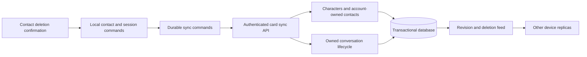

# Characters, contacts, and conversation ownership

## Status

This server PR is stacked on the character UI foundation in PR #2672.
Its own diff contains the hosted contract, schema, migrations, and server tests.
Client synchronization and its UI verification belong to the separate client PR.

The user accepted the direction: characters define identities, contacts represent
personal relationships, and conversations contain participants and messages.
The schema, migration, and release boundaries below remain proposed.
Legacy conversations with no reliable owner need a confirmed migration policy
before implementation.

This document describes planned work, not a deployed contract. PR #2672 must not
be merged as a complete cloud-sync implementation yet.

## Context

The local `airi-card-catalog` stores private cards in local storage. The hosted
`characters` tables serve a different model, including covers, likes, and prices.
Sharing the v2 card UI does not make these two persistence models identical.

`chat_members.character_id` currently stores an unconstrained string.
`listChats` does not return character membership. The client adopts remote-only
chats under `default`. Strict character filtering makes that lost association
visible to users on a new device.

The current card delete action retains conversations. The user has replaced
that policy: confirmed card deletion must also delete its bound conversations.

## Proposed decision

### Domain boundaries and product names

- A character owns its persona and default display, speech, and model settings.
  The interface calls this concept Character, not Character Card.
- A contact belongs to one account and references a character. It owns personal
  overrides and the relationship lifecycle, not the public marketplace source.
- Adding a character to My Characters also creates its contact in one operation.
  The user does not need to create the same identity twice.
- A direct conversation belongs to an account and a contact. One contact can
  have multiple conversations, which preserves the existing history selector.
- A group conversation owns its participant list. Messages reference a stable
  participant identity, not only the generic assistant role.
- Character Card remains the name of the import/export format. Importing a card
  creates the character and contact through the same domain operation.
- The chat interface shows Contacts. The character editor remains the place for
  persona and model settings. This work does not introduce another page redesign.

### Ownership and schema

- Preserve existing local character ids through an explicit account-scoped mapping.
  The built-in `default` id is not a globally unique character or contact id.
- Define character and contact identities separately. Reuse the hosted character
  domain where its ownership and visibility rules fit private definitions.
  Do not create a second competing character store without resolving this boundary.
- Keep private card ownership separate from public marketplace ownership.
  Deleting a private card must not delete a marketplace source or another user's
  copy, conversation, or shared group history.
- Store the portable card definition, its revision, and its deletion marker.
  Validate the document with Valibot. Do not sync provider credentials or local
  filesystem paths inside a card document.
- Add an explicit contact binding for one-to-one character conversations.
  Enforce the account/contact relationship in the database and in write commands.
  Preserve the existing multi-member model for group and channel conversations.
- Return the binding through chat create, list, and detail contracts. The client
  must use it when restoring history, rather than assigning `default`.
- Keep model references in the card. Missing device-local model assets remain
  visibly unavailable; this change does not upload model binaries.

### Confirmed deletion

1. Show the contact name and warn that all direct conversations with it will be
   deleted on this device and from cloud sync. Offer Cancel and a destructive
   confirmation action. Do not report a local-only count as a cloud total.
2. Persist a deletion command before removing local data. Signed-out local-only
   cards use the same local cascade without issuing a cloud command.
3. The server verifies account ownership and atomically marks the contact,
   its direct conversations, and their messages deleted.
   A private character definition is deleted only when no retained reference needs it.
   Marketplace sources and other accounts remain unchanged.
4. Return a durable deletion revision and affected conversation identities.
   Repeating the same command returns the committed result without new effects.
5. Other devices consume explicit deletion markers and remove the corresponding
   card, history, and queued outgoing messages. Missing rows from a partial list
   are not evidence of deletion.
6. Reject stale card updates, chat creation, and message writes after deletion.
   Serialize these checks with deletion so an in-flight write cannot recreate
   a descendant after the cascade finishes.
7. Cancel in-flight inference and speech for deleted conversations. A late local
   completion must not recreate history or enqueue an upload.

Offline deletion stays pending until the server acknowledges it. Keep deletion
markers long enough to reject stale replicas; do not discard them merely because
one device acknowledged them. Soft deletion follows the existing backend policy;
the UI must not promise immediate physical erasure from backups.

Contact deletion does not delete group conversations. The proposed group policy
ends that contact's participation and prevents future replies in the affected groups.
Past group messages retain their speaker identity and a minimal display snapshot.
This policy needs explicit acceptance before the group implementation.
Deleting a character source is distinct from deleting a personal contact.

### Migration and rollout

- Preserve conversation ids, cloud ids, message ids, and message sequence values.
  The migration must not duplicate or delete existing messages.
- Backfill a binding only when existing account and character membership identify
  one owner. An id without an available card definition is not a restored card.
- Proposed unresolved-history policy: preserve ambiguous histories as unbound,
  expose them through a history entry, and let the user assign a card explicitly.
  Never infer ownership from a display name or the currently selected card.
- Do not cascade-delete unbound histories during migration or unrelated deletion.
- Register characters and contacts before new bound chat creation. An old client
  must not bypass deletion checks by sending only `members.characterId`.
- Deploy and verify the server migration/contracts before releasing the client
  that requires them. Define the old-client admission policy explicitly; do not
  add a silent client fallback that restores all histories under `default`.
- Run migration tests on synthetic fixtures. Production data changes or rollout
  require separate approval and acceptance.

## Module dependency graph



## Affected-file tree

```text
server/apps/api/
  src/schemas/                 characters, contacts, participants, and chat binding
  src/services/domain/        contact lifecycle and transactional direct-chat cascade
  src/routes/                 validated replica and chat contracts
  src/app.ts                  dependency wiring and account deletion registration
  drizzle/                    schema migration and snapshots
packages/stage-ui/src/
  stores/modules/airi-card*   explicit private-card sync and delete commands
  stores/chat/session-store  binding restore, cascade, and late-write guards
  libs/chat-sync/             binding and deletion transport
  database/repos/            pending deletion persistence
packages/stage-pages/src/pages/settings/airi-card/
  components/                confirmation, pending state, and errors
packages/i18n/src/            English and Chinese deletion warnings
```

## Deletion sequence

```mermaid
sequenceDiagram
  actor User
  participant A as Device A
  participant Server
  participant DB
  participant B as Device B
  User->>A: Confirm contact and direct-conversation deletion
  A->>A: Persist command and block new local sends
  A->>Server: Delete owned contact with operation identity
  Server->>DB: Lock owner/contact and atomically delete direct descendants
  DB-->>Server: Committed revision and conversation identities
  Server-->>A: Acknowledge committed deletion
  A->>A: Finish local cascade and remove acknowledged command
  B->>Server: Synchronize after reconnect
  Server-->>B: Card and conversation deletion markers
  B->>B: Cancel sends and remove deleted local data
  B->>Server: Retry stale queued message
  Server-->>B: Reject deleted conversation; do not recreate it
```

## Requirements and test plan

| Requirement | Status | Required evidence |
| --- | --- | --- |
| Explicit cloud card binding | Proposed | Create/list/restore preserves ownership on a clean device |
| Confirm card and chat deletion | Required | Cancel has no effects; confirm includes local and cloud scope |
| Server cascade and account isolation | Required | Same card id in two accounts cannot cross-delete |
| Idempotent offline retry | Required | Reconnect, timeout after commit, and repeated delete converge |
| Reject late writes | Required | Race message/card/chat creation against deletion |
| Existing-user migration | Awaiting ambiguous-history policy | Preserve ids and message counts; no guessed binding |
| Prevent deleted-data resurrection | Required | Stale device sync and queued sends cannot restore descendants |
| Model portability | Scoped | Missing local assets show unavailable without changing ownership |
| Contact lifecycle | Required | Add/import creates one usable contact without duplicate identities |
| Group history retention | Proposed for later PR | Contact deletion stops replies without deleting group messages |

## PR boundaries and release gates

The proposed split has three near-term PRs and one later group PR.
These are dependency boundaries, not permission to release incomplete behavior.

| PR | Scope | Acceptance and release gate |
| --- | --- | --- |
| 1. Character UI and local isolation | Reusable v2 presentation, editor model tab, terminology, window-local selection | No new cloud contract dependency. Exclude strict history filtering unless restore remains correct. |
| 2. Contact persistence and sync contract | Character/contact ownership, direct-chat binding, migration, deletion commands, tombstones, stale-write rejection | Server tests prove account isolation and migration safety. Explicit old-client admission policy precedes deployment. |
| 3. Contact-based direct chat | Client replicas, reliable restore, contact-scoped history, unbound-history access, confirmed local/cloud deletion | Depends on PR 2. Upgrade and two-device/offline tests pass before releasing the new workflow. |
| 4. Group conversations | Participant management, speaker attribution, reply scheduling, context isolation, cancellation, group UI | Follows the direct-chat contract. Group deletion and participation rules need separate acceptance. |

PR #2672 remains open. Its current changes need classification before any branch split.
Pure presentation and local-isolation changes can form PR 1.
Contact-scoped filtering and lifecycle changes belong with PR 3 when they require
the new restore contract. Resolved review comments do not remove this release dependency.

The server PR must not reinterpret a legacy delete request as destructive contact
deletion. The new client uses an explicit confirmed-deletion command.
No PR may enable strict contact filtering while remote histories still restore
under `default`. Merge, deployment, client release, and production acceptance remain separate steps.

## Non-goals

- Group reply orchestration in the current direct-chat refactor.
- Marketplace publishing changes or automatic upload of model binaries.
- Unrelated UI redesigns or silent reassignment of ambiguous histories.
- Production migrations, branch rewrites, or PR publication through this design update.

## Implementation order

### First implementation slice: hosted contact ownership

The implementation adds contacts that reference the existing hosted `characters` table.
It does not copy character definitions into a second catalog.
Only the owner of an active public hosted character can register that source directly.
Private imports use the versioned document command described below.
Marketplace acquisition remains outside this implementation.

Contacts have globally unique ids and a unique `(owner_id, character_id)` pair.
Deleted contacts retain that pair as a tombstone. Repeating registration returns
the active contact or rejects the deleted identity; it never restores a tombstone.
The contacts list includes tombstones and a per-contact revision, not a timestamp cursor.
It is a full account snapshot. A client must not infer deletion from absence.

Bound bot chats store `contact_id` and `contact_owner_id` with a composite foreign key.
The new create command derives members from the authenticated owner and contact.
It rejects caller-supplied members for bound chats and rejects later membership edits.
SQL migrations leave old bindings empty. Registration binds only exact owned memberships;
the migration never guesses from a name or the currently selected character.

Contact deletion locks the contact before its chats. Chat creation uses the same
contact lock. Message writes lock the chat before checking its deletion marker.
This ordering prevents new descendants after deletion without a contact/chat lock cycle.
Deletion leaves public character definitions and group history intact.
The response includes all bound chat ids and the retained contact revision.
Retries return the same deletion result without changing its revision.

The additive migration must not ship as the complete contacts feature.
Client definition import, unbound-history access, local deletion outbox, and
two-device acceptance remain required before PR 3 can release.

### Private definition sync contract

Private imports reuse `characters` with an explicit private visibility flag.
The marketplace service excludes these rows from reads and writes, including
direct id lookups. Contact-owned documents live in a one-to-one table and never
appear in marketplace responses. The contact API validates stored JSON on reads.

The shared portable document admits persona fields, reviewed module selections,
and agent prompts. It excludes credentials, arbitrary extension data, local paths,
and image-generation options. Clients retain unsupported local fields locally.
Empty module selections keep their inheritance meaning; sync does not resolve
them to the device's current global configuration.

Private import uses an account-scoped local character id, an expected revision,
and a durable mutation id. Registration and first definition storage are atomic.
Retries with the same mutation and document return the committed result.
Other stale revisions fail with a conflict instead of overwriting another device.
Deleted contacts reject every write, including a replayed create request.

Deletion also soft-deletes the private character and removes its private document.
Public character sources remain unchanged. Contact identity and revision remain
as deletion markers. Old histories are not guessed during SQL migration.

Registration holds an account/local-id advisory transaction lock before the contact
row lock. Legacy bot creation takes the same identity lock before admission checks.
Only an exact single-user, single-character bot history can migrate automatically.
The server preserves its chat id, message ids, sequence values, and timestamps.
Shared or ambiguous histories remain unbound. Explicit assignment is available
only for an owned bot conversation with no other user members.

### Delivery checklist

Deletion also accepts an account-scoped local character identity. The endpoint requires
the same direct-history consent. It creates a tombstone even if import never completed.
Import and deletion share the identity lock. A delayed import cannot recreate a deleted
character. This command does not upload the deleted character definition. The built-in
character rejects ordinary deletion; account erasure can remove it.

The client persists each account catalog and its pending commands as one IndexedDB
record. It publishes state only after storage succeeds. The first signed-in account
claims the old device-wide catalog. Other accounts do not receive that catalog.
Account changes hide the previous catalog before asynchronous loading begins.
Deletion markers override pending edits. Conflicting revisions retain both versions
until the user selects one. Missing list entries do not mean deletion.

The shared `/contacts` package export owns the portable HTTP contracts. The root
export continues to own WebSocket contracts.

- [x] Hosted contact registration, account isolation, direct-chat binding, and deletion tests.
- [x] Additive migration and API contracts; existing histories remain unmodified in the migration fixture.
- [x] Server private character import and portable settings without credentials.
- [ ] Client contact replicas, restore, and unbound-history access.
- [ ] Confirmed deletion, durable offline retry, and late-completion cancellation.
- [ ] English/Chinese naming, UI acceptance, and separate PR publication.

### Local verification on 2026-09-28

- Six focused test files pass: 43 tests across domain commands, HTTP consent,
  private visibility, revision conflicts, migration preservation, and database lock ordering.
- The concurrency regression ran against disposable PostgreSQL 18.6.
  With the previous write sequence, the late message was accepted at sequence 8.
  With locked authorization, that write returns 404 and does not persist.
- Contact deletion and concurrent direct-chat creation serialize without deadlock
  in the tested order. Creation after deletion returns 404.
- A second Drizzle generation reports no schema changes.
- Full `pnpm lint` passes with 647 existing warnings and no errors.
- Full `pnpm typecheck` passed after the workspace dependency state was refreshed.
  The previous Apple IAP and AWS S3 import failures no longer occur in that run.

No production database was accessed or migrated. No PR was split or published.
The client has a durable contact replica and account catalog. Conversation
reconciliation calls the contact engine first. These tests do not establish
two-device or UI acceptance.

### Client foundation verification on 2026-09-28

- Thirteen Node tests pass for portable documents, HTTP validation, durable edits,
  lost responses, conflicts, deletion priority, and closed-account completion.
- Fifty-two browser tests pass for card settings, account isolation, persistence,
  inheritance, and cross-window snapshots.
- The account migration regression first failed because the initial login ignored
  anonymous IndexedDB edits. A second regression exposed deleted legacy characters
  returning during import. Both tests pass after the migration change.
- Forty-three backend tests pass across five domain and HTTP files, including
  deletion before first import, retry consent, and built-in character protection.
- Full typecheck passes all 52 tasks. Full lint reports no errors and 647 warnings.
- The targeted Electron profile creation browser test passes. Earlier cold runs
  stopped during Vite dependency optimization, before test execution.

### Conversation binding verification on 2026-09-28

The client restores verified contact ownership and moves unknown histories to a
null character binding. Metadata writes preserve unloaded message payloads.
Only registered contacts can create cloud conversations. A conflicting chat id
cannot be claimed for another contact. Confirmed deletion removes local direct
histories and their outbox entries, but retains groups.

- Fifty-six focused Node tests pass for mapping, session commands, and contact replication.
- Seventeen browser tests pass for restoration, creation, deletion, inheritance,
  and cross-window behavior. The restoration tests use real stores and IndexedDB.
- Full typecheck passes all 52 tasks. Full lint reports no errors and 647 warnings.
- English and Chinese deletion text now describes local and cloud history removal.

### History and synchronization controls

The selector now has a separate unassigned-history view. Users can read these
histories without changing the current character. They can assign an unbound
direct conversation to the current character after cloud contact synchronization.
Group histories cannot use this assignment action. Metadata changes preserve messages.

The character library and profile show pending changes and revision conflicts.
Users can keep the device or cloud version. Deletion waits for local persistence,
shows failures, and leaves cloud deletions queued for synchronization.

Thirty-five browser tests pass across contact restoration, assignment, account
catalogs, and conversation controls. A separate deletion-dialog browser test passes.
An account-switch regression failed before the fix and passed afterward:
the previous account's synchronization error no longer appears for the new account.

English and Chinese management labels use Character and 角色. Character Card
still names the portable format. The glossary now prefers Character.
Glossary generation and all 20 i18n tests pass. Full typecheck passes all 52 tasks.
Full lint reports no errors and 647 warnings. `git diff --check` passes.

No new PR has been published. Full visual acceptance, conflict-control browser
coverage, and two-device acceptance remain open. A pending assignment also needs
a navigation-race check before publication.

1. Confirm the legacy unbound-history policy and record the accepted contract.
2. Add schema, migration, validated APIs, transaction tests, and deletion feed.
3. Add client card sync, reliable binding restore, and durable deletion retry.
4. Add confirmation text and progress/error behavior without redesigning pages.
5. Verify upgrade, two-device deletion, offline reconnect, and late completions.
6. Update PR evidence. Keep deployment and production acceptance separate.
