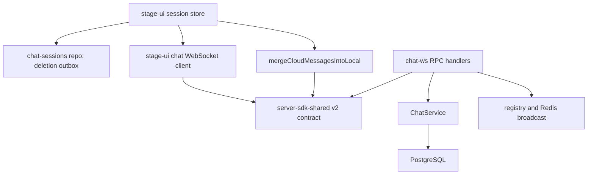
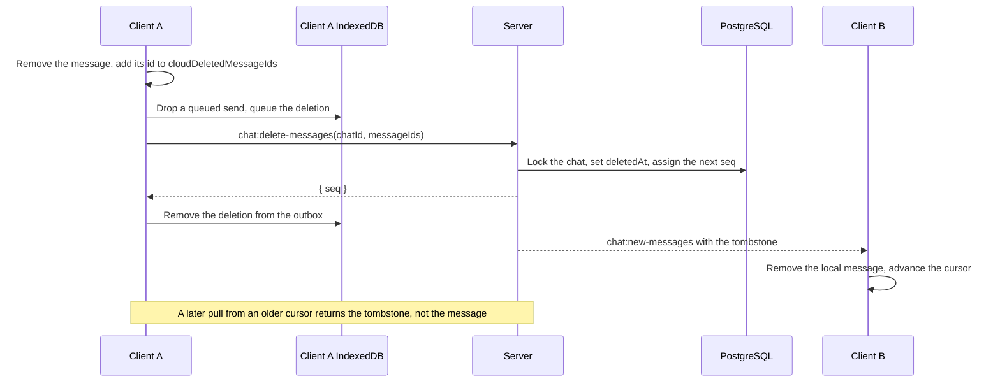

# Chat message deletion sync

Status: proposed

## Context

A client deletes a chat message only in local state. The server keeps the row, and `pullMessages` returns it again.
A pull from an older cursor, a second device, or a new device brings the message back.
Issue #2671 shows this after a switch of the character card.

The `messages` table already has `deletedAt`, but no chat API writes it.

## Decision

Deletion is a synchronized change with its own sequence number.

- The new WebSocket RPC `chat:delete-messages` takes a chat id and message ids.
- The server sets `deletedAt` on each matching live message and gives it the next `seq` of the chat.
- `pullMessages` and the `chat:new-messages` broadcast return a deleted message as a tombstone: the message id, its new `seq`, `deletedAt`, and empty `content`.
- A client removes the local message when it receives a tombstone. It does not append a tombstone. The client rules below keep the deletion on the client.
- `sendMessages` never restores a deleted message. A send with a deleted id changes nothing.
- A deletion of an id without a row stores the intent as a tombstone row. The row has the caller as sender, the next `seq`, `deletedAt`, empty content, and the placeholder role `user`.

A deletion that has its own `seq` reaches every client through the cursor that already exists. No second cursor or full resync is necessary.

### Order of a send and a deletion

A client can delete a message while its send is still on the wire, or after a send whose response was lost.
The deletion can then reach the server first.
The tombstone row for the unknown id makes the later send change nothing.
Both requests lock the chat row, so the result is the same in either order.
The client does not need to track sends in flight.

### Client rules

The server `seq` orders changes on the server. It does not stop a client from merging an older copy of a deleted message.
Each session therefore keeps the ids of its deleted messages in `ChatSessionMeta.cloudDeletedMessageIds`, beside the `cloudMaxSeq` cursor.

- A local deletion adds the id before any await, together with the removal of the message. The id is in the set before the server confirms the deletion.
- A received tombstone adds the id.
- The merge drops every live wire message whose id is in the set. The server never restores a deleted message, so such a copy is always stale.

These rules cover two orders:

- **Pending local deletion.** A reconnect pulls every session before it drains the outbox. The pull still returns the message, because the server has not received the deletion. The merge drops it.
- **Late send broadcast.** A send broadcast or a pull response can arrive after the tombstone of the same message. The merge drops it.

The set grows only with deletions, and no later point makes an id safe to forget. It is removed with its session.

A load from IndexedDB keeps these rules. `refreshSession` can read a record that predates a tombstone merged during the read. The load takes the higher `cloudMaxSeq` and the union of `cloudDeletedMessageIds` from the record and from memory. It then removes messages with deleted ids from the loaded history.

The push schema in the WebSocket client declares `deletedAt`. A Valibot object schema drops undeclared keys, so without it a tombstone reaches the merge as a live message.

Outbox settlement matches the message id and the operation kind. A deletion replaces a queued send of the same message, so the settlement of that older send must not remove the deletion.

### Permissions

The caller must be a member of the chat.
A member can delete a message that they sent.
A message without a sender is a row from before message ownership. It can be deleted only while the caller is the only user member of the chat.
The chat type does not prove this, because `createChat` and `addMember` accept more user members in every chat type.
A message of another member makes the whole request fail with `403`. No row changes.

### Idempotency

An id that is already deleted changes nothing.
An id from another chat changes nothing. Its row blocks a tombstone, and this chat cannot delete it.
A retry of the same request returns success and changes nothing.

## Older clients

Clients released before this change (for example v0.12.0-beta.5) keep their current behavior: a deletion on another device does not reach them.

- A message that the older client already has stays. Its merge skips a known id.
- A message that the older client never had arrives as an empty message instead of the deleted text. Its push schema does not declare `deletedAt`, so it reads the tombstone as a message with empty content.
- An older client never sends deletions, so its own deletions stay local.

After an update, the client receives every later deletion.
Deletions from before the update do not reach it, because its saved cursor is already past them.
This matches the current behavior, in which no deletion syncs.
The user can delete such a message again, and the server treats a repeated deletion as a no-op.

No version negotiation or replay is added.

## Scope

- Contract: `DeleteMessagesRequestSchema`, `DeleteMessagesResponse`, the `deleteMessages` event, and `WireMessage.deletedAt` in `@proj-airi/server-sdk-shared`.
- Server: `ChatService.deleteMessages`, tombstones in `pullMessages`, the deleted-id guard in `pushMessages`, and the RPC handler with the existing broadcast.
- Client (`stage-ui`): deletion entries in the IndexedDB outbox, outbox settlement by id and kind, the `deleteMessages` call and the `deletedAt` push schema in the WebSocket client, `cloudDeletedMessageIds` in the session meta, and the merge rules above.

## Non-goals

- Message edits from another device. The client still keeps its local copy of a known id.
- A hard delete or a retention job for soft-deleted rows.
- Deletion of messages that other members sent.
- Changes to the REST chat routes.
- The `undefined` error message in the `pullMessages` warning. It comes from how eventa serializes `ApiError`, and it needs a separate change.

## Module dependencies



## Affected files

```text
server/
  docs/ai/adr/2026-09-28-chat-message-deletion-sync.md
  packages/server-sdk-shared/src/
    chat.ts
    v2.ts
  apps/api/src/
    routes/chat-ws/rpc.ts
    services/domain/
      chats.ts
      chats.test.ts
packages/stage-ui/src/
  types/chat-session.ts
  database/repos/
    chat-sessions.repo.ts
    chat-sessions.repo.test.ts
  libs/chat-sync/
    ws-client.ts
    ws-client.test.ts
    wire-message.ts
    wire-message.test.ts
  stores/chat/
    session-store.ts
    session-store.test.ts
```

## Deletion sequence



## Verification

Service tests use the existing PGlite database:

- A deletion sets `deletedAt`, assigns a new `seq`, and `pullMessages` returns a tombstone with empty content.
- A second deletion of the same id changes nothing.
- A deletion that arrives before the send of the same id keeps the message deleted.
- A deletion of an id from another chat changes nothing.
- A deletion of a message of another member fails with `403` and changes nothing.
- A message without a sender can be deleted while the caller is the only user member. A `bot` chat with a second user member rejects it.
- `pushMessages` with a deleted id does not restore the message.
- Each rule was disabled in turn, and at least one test failed each time.

Client tests:

- Merge: a tombstone removes the local message and is not appended.
- Merge: a live copy that arrives after the tombstone of the same id is dropped.
- Merge: a live copy of an id with a pending local deletion is dropped.
- WebSocket client: a broadcast tombstone keeps `deletedAt` through the push schema, and the merge then removes the message.
- Repository: a deletion replaces a queued send, and the settlement of that send keeps the deletion.
- Session store, with the real merge: an offline deletion, then a reconnect whose pull returns the message from cursor `0` before the outbox drains. The message stays deleted in memory and in the saved session, and the deletion is sent. This reproduces issue #2671.
- Session store: a tombstone broadcast, then an older send broadcast of the same id. The message stays deleted, and the meta keeps the id.
- Session store: a deletion is queued and sent directly, and a queued deletion is sent when the outbox drains.
- Session store: `refreshSession` reads an older IndexedDB record while a tombstone is merged. The message stays deleted, and the meta keeps the higher cursor and the deleted id.
- Each client rule was disabled in turn, and at least one test failed each time.
