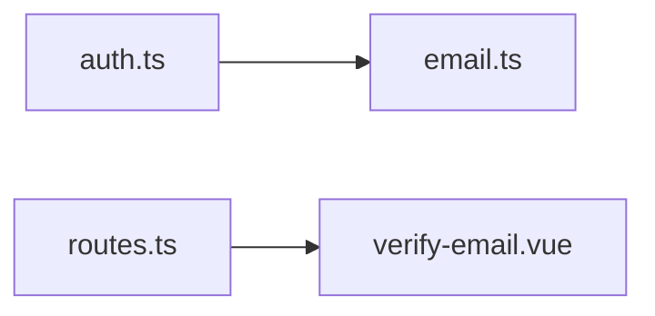
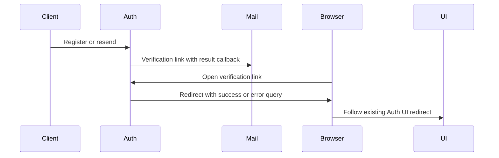

# Email verification landing

Status: accepted

## Decision and scope

Better Auth defaults registration and resend callbacks to `/`, which displays API JSON after verification.
Before email delivery, replace missing, empty, and root callbacks with `/auth/verify-email?verified=true` under `PUBLIC_URL`.
The existing Auth route redirects to the configured account UI. Explicit non-root callbacks remain unchanged.
The UI treats verification as successful only when no error is present, preventing false analytics and cross-tab notifications.
This default is supported policy. Tokens, sessions, database schema, and previously delivered emails remain unchanged.
Deploy Auth and the Auth UI to apply both fixes.

## Dependencies and affected files

Changed files: `server/apps/auth/src/auth.ts`, `apps/ui-server-auth/src/pages/verify-email.vue`,
`server/apps/auth/src/tests/email-verification.test.ts`, and this ADR.

## Verification flow

## Validation

Exercise registration, resend, successful verification, invalid tokens, and explicit callbacks through real Auth handlers with PGlite.
Run existing Auth and Auth UI tests, workspace typechecks, and repository lint.
The result page must suppress success analytics and broadcasts when `verified=true` accompanies an error.
