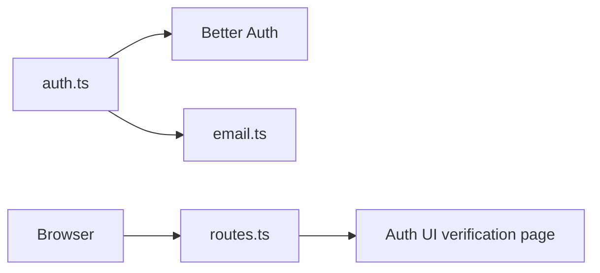
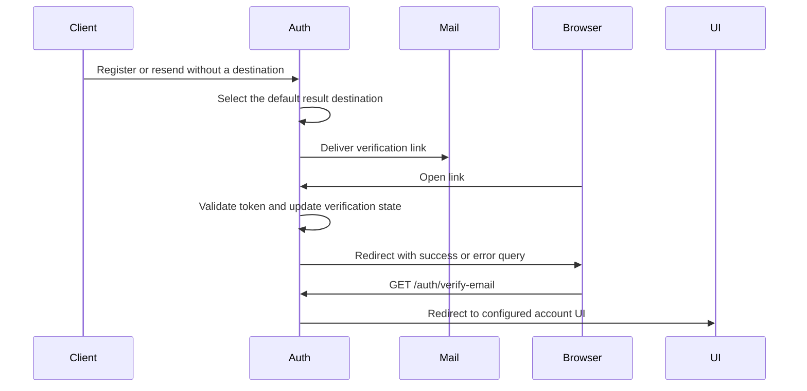

# Email verification landing

Status: accepted

## Decision

The Auth service owns the default email verification landing page.
Better Auth generates `callbackURL=/` when registration or resend requests omit a callback.
That URL returns verified users to the API root without a result message.

Before delivery, replace missing, empty, or root callbacks with `/auth/verify-email?verified=true` under `PUBLIC_URL`.
The existing Auth route selects `AUTH_UI_URL` and preserves success or error query parameters.
Failed callbacks retain the success query flag. The result page handles errors before success analytics or cross-tab notifications.
Explicit non-root callbacks remain unchanged and retain Better Auth origin validation.
This default is supported product policy, not temporary compatibility behavior.

## Scope and non-goals

Cover newly generated registration and resend verification emails.
Keep tokens, expiry, session creation, and database verification behavior unchanged.
Do not rewrite previously delivered emails or change the API root.
No database migration or new dependency is required.

## Module dependencies



## Affected files

```text
apps/ui-server-auth/
  README.md
  vitest.config.ts
  src/pages/verify-email.vue
  src/pages/verify-email.browser.test.ts
server/
  apps/auth/
    README.md
    src/auth.ts
    src/tests/email-verification.test.ts
  docs/ai/adr/2026-09-30-email-verification-landing.md
```

## Sequence



## Test plan

Exercise real Auth HTTP handlers with PGlite and a mocked mail delivery boundary.
Check omitted, empty, and root callbacks for registration and resend.
Follow verification links and check database state and redirect destinations.
Check invalid tokens return an error query to the result route.
Check explicit callback URLs retain their query parameters.
Run Auth tests, Auth typecheck, and repository lint.

Mount the result page in Chromium with invalid and expired token errors plus `verified=true`.
Check failure analytics, absent success broadcasts, and the successful verification control case.
