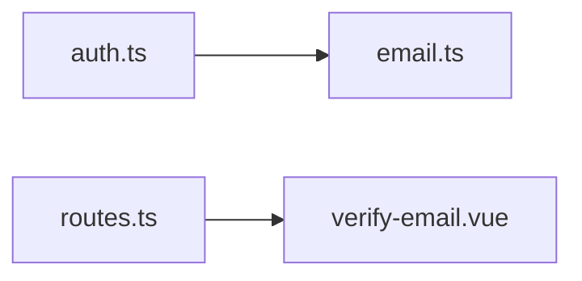
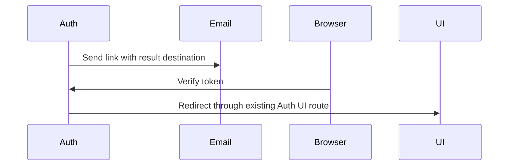

# Email verification landing

Status: accepted

## Decision

Registration and resend emails replace missing, empty, or `/` callbacks with `/auth/verify-email?verified=true` under `PUBLIC_URL`.
Explicit destinations and tokens remain unchanged. The result page suppresses success events when an error is present.
This is supported default policy. Existing emails and database schema remain unchanged. Deploy Auth and Auth UI together.

## Dependencies and affected files

Changes: `server/apps/auth/src/{auth.ts,tests/auth.test.ts}`, `apps/ui-server-auth/src/pages/verify-email.vue`, and this ADR.

## Flow and validation

Test the shared email hook for omitted, empty, root, and explicit callbacks, including token preservation.
Run existing Auth and Auth UI tests, typechecks, and lint. Check that error results emit no success events.
