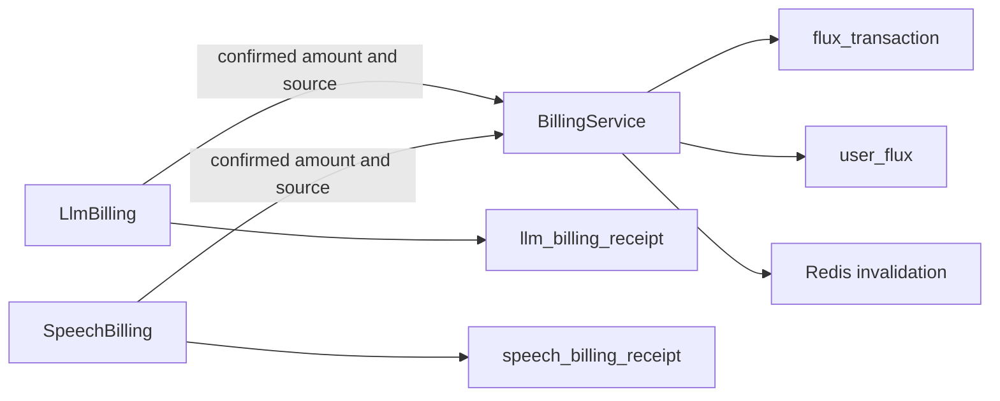
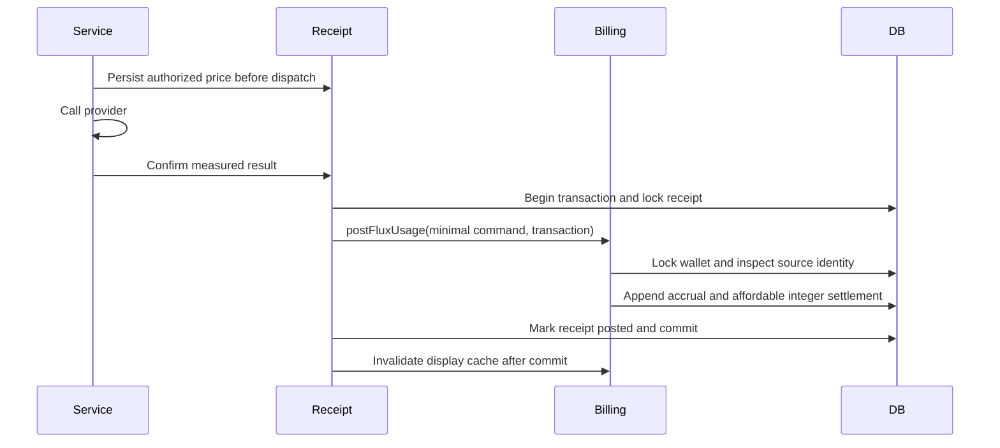

# Flux posting and service receipts

Status: accepted

## Decision

The wallet accepts `postFluxUsage({ userId, source: { type, id }, amountMicroFlux })`.
The contract contains no model, turn, attempt, pricing, provider, or pending state.
`flux_transaction` owns immutable consumption accruals and integer balance changes.
`user_flux` stores integer Flux and shared outstanding micro-Flux.
One Flux equals 1,000,000 micro-Flux.
LLM and speech services own their durable pricing and execution receipts.

## Scope

Remove the proposed `flux_usage` table. Extend the existing ledger with accrual amounts, outstanding snapshots, and source identity.
Keep historical integer ledger facts. Rename the LLM evidence table to `llm_billing_receipt`.
Speech receipts own authorized prices and final weighted units. Unknown fees never enter the ledger.
Credits settle affordable outstanding fees. Admin adjustments preserve outstanding fees.

## Non-goals

Admission reservations, automatic receipt reconciliation, refunds, and historical repricing remain outside this change.

## Invariants

Source identity is unique per wallet for consumption accruals, including zero amounts.
A duplicate source with a different amount fails. An identical replay never accrues twice.
The posting transaction writes the accrual, integer settlement, wallet snapshot, and service receipt together.
Accrual rows do not change integer balance. Settlement rows reduce outstanding fees by their integer debit times 1,000,000.
Service evidence survives diagnostic deletion. Ledger replay never requires service evidence.

## Module graph



## Affected files

```text
server/apps/api/
  drizzle/0028_flux_posting.sql
  src/schemas/{flux,flux-transaction,llm-billing-receipt,speech-billing-receipt}.ts
  src/services/domain/billing/{billing-service,llm-billing,speech-billing}.ts
  src/routes/{flux,openai/v1,audio-speech-ws}/
  src/app.ts
```

## Posting sequence



## Migration and rollout

Migration 0028 is unpublished to production. This PR replaces its proposed shape rather than adding a migration for the rejected shape.
Stop old API writers before migration and freeze TTS Redis debt with the cutover rate.
Historical LLM requested and charged fields retain their original whole-Flux evidence. They do not enter the new accumulator.
Import frozen TTS debt through the same minimal posting contract. Keep the immutable export as its source evidence.
Compare imported totals before removing old counters. Then start new writers.
Mixed old and new writers and an application-only rollback are unsupported.
No production migration or deployment runs in this task.

## Verification

Run service tests, wallet ablation tests, full API tests, API and root typechecks, schema generation, and root lint.
Ablation proves that direct posting without models, prices, receipts, or execution IDs still supports deduplication, concurrency, and conservation.
Delete service receipts after posting and repeat the ledger command to prove independent replay.
Use actual SQL migrations for historical preservation tests and local PostgreSQL for concurrent connections.
