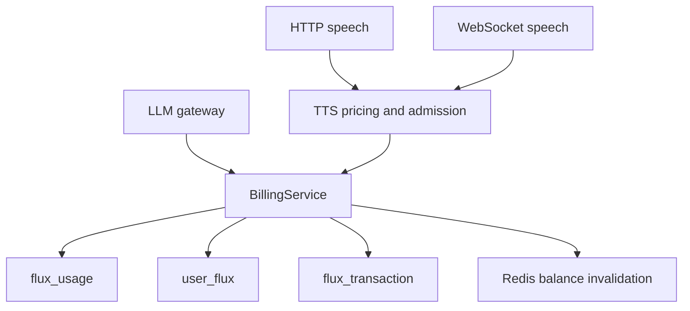
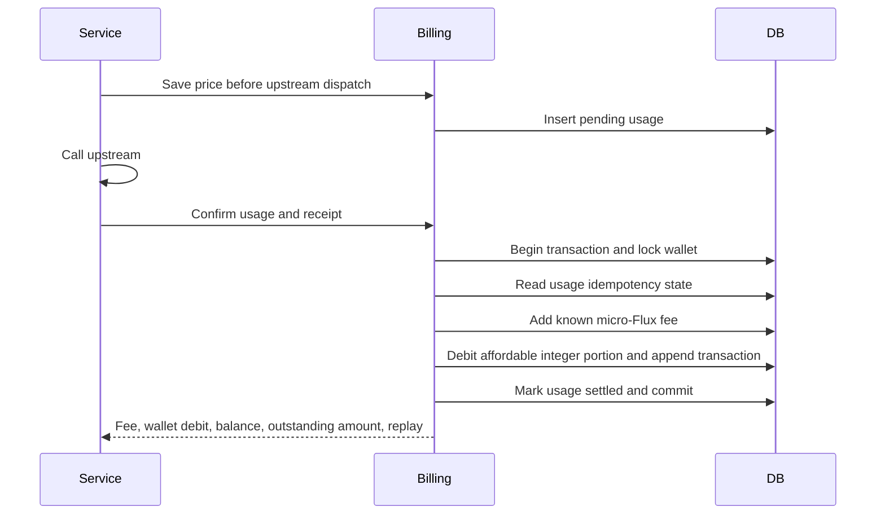

# Unified Flux usage

Status: accepted

## Decision

`flux_usage` owns durable service fees. `user_flux` owns the wallet snapshot. `flux_transaction` owns integer balance changes.
LLM and TTS share `user_flux.unsettled_micro_flux`. One Flux equals 1,000,000 micro-Flux.
A known fee enters the wallet once, even when no integer debit occurs. Unknown fees remain pending.
Each account serializes fee posting and wallet changes with a PostgreSQL row lock.
Network calls run outside the wallet transaction.

## Scope

- Rename `llm_request_settlement` to `flux_usage` and migrate its financial evidence.
- Store service, pricing, receipt, exact micro-Flux fee, and posting status.
- Replace Redis TTS character debt with durable usage and the shared wallet accumulator.
- Preserve integer transaction amounts and label pooled debits as `usage_settlement`.
- Settle confirmed outstanding fees after credits. Admin balance changes preserve outstanding fees.
- Return the outstanding amount with the wallet. Read admission state from PostgreSQL.

## Non-goals

- Distributed admission reservations or background reconciliation workers.
- Changing payment amounts, upstream adapters, audio delivery, or currency units in historical transactions.
- Repricing historical usage or editing posted fees. Corrections require a separate financial operation.

## Invariants

A posted usage event never enters the accumulator twice.
A wallet debit never exceeds its integer balance.
Outstanding micro-Flux never expires and can exceed one Flux when the wallet cannot cover confirmed fees.
For new usage, confirmed fees equal settlement debits times 1,000,000 plus the change in outstanding micro-Flux.
Zero fees are distinct from unknown fees.
Historical posted usage retains its original billed precision. Migration does not invent exact historical costs.

## Module dependencies



## Affected files

```text
server/apps/api/
  drizzle/0028_flux_usage.sql
  src/schemas/{flux,flux-usage,flux-transaction,index}.ts
  src/services/domain/billing/{billing,billing-service,speech-billing}.ts
  src/services/domain/{flux,flux-cache,openai-speech}/
  src/routes/{flux,openai/v1,audio-speech-ws}/
  src/app.ts
  src/services/adapters/config-kv/definitions.ts
```

## Posting sequence



## Migration and rollout

Stop old API writers before the schema migration. Do not run mixed old and new billing writers.
Retain historical request and transaction identifiers. Preserve historical integer billing amounts without replaying them into the wallet.
Pending LLM receipts use their saved pricing when confirmed under the new policy.
Before deployment, export Redis TTS counters while old writers are stopped. Keep the export for audit.
Import each counter once as a `tts` usage event with an explicit migration identifier and pricing snapshot.
Do not delete old counters until import conservation checks pass. Then deploy new writers and remove the obsolete counters.
No production import or deployment runs as part of this source change.

## Test plan

Cover exact decimal pricing, shared LLM/TTS thresholds, zero fees, missing costs, replay, conflicting receipts, partial debits, and credit recovery.
Cover transaction rollback, admission against outstanding fees, HTTP speech, WebSocket speech, and cache-independent wallet reads.
Run the API typecheck, API tests, root typecheck for exported contracts, and root lint.
Use production migrations for migration tests. Use a dedicated local PostgreSQL database for concurrent row-lock checks when available.

## Delivery checks

The usage status `settled` means that the fee entered the shared accumulator. It does not mean that its whole amount left the wallet.
`wallet_debit_flux` records the debit triggered by posting, which can include other services. It is not the service fee.
The migration importer defaults to a dry preview and requires explicit import database and Redis URLs for writes.
