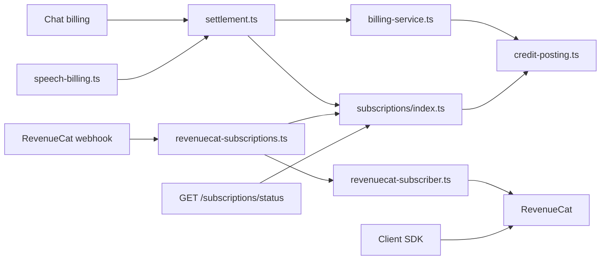
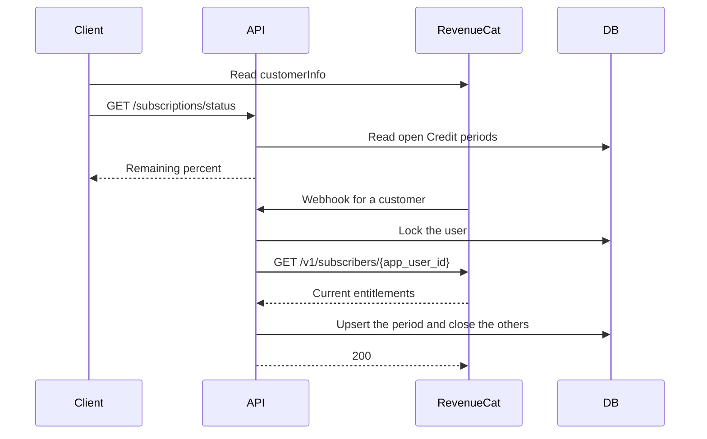

# Subscription Credits and plan changes

Status: accepted

## Decision

RevenueCat is the source for entitlement status.
The local database does not store subscription status and does not store webhook events.

The app reads `customerInfo` in the client SDK for the current plan, expiry, and management URL.
The server reads `GET /v1/subscribers/{app_user_id}` to grant plan Credits.

Plan Credits stay local.
The server does not select a Credit rule from the webhook event type.
A webhook only tells the server that a customer changed.
The server then reads the customer's entitlements from RevenueCat and makes the Credit ledger match.
RevenueCat recommends this pattern in its webhook guide.

The ledger holds one open Credit period for each user.
The period is the active entitlement of a mapped plan.
The latest purchase wins when two plans are active.
The user, the entitlement, and the purchase time identify the period.

- A new period gets a full grant.
- A known period keeps its spent Credits and takes the reported end time.
- Every other open period of the user closes, and its unused Credits are forfeit.
- All periods close when RevenueCat reports no active plan.

These rules cover purchase, renewal, product change, extension, expiration, refund, and transfer.
A repeated delivery or a late delivery gives the same result, so the server keeps no event log.
`TRANSFER` names its users in `transferred_from` and `transferred_to`. The server reconciles each of them.

The sync holds a Postgres advisory lock for the user while it reads RevenueCat.
Two webhooks for one user cannot write an older answer after a newer answer.
The read has a 5-second timeout.

The webhook returns an error when the read fails or `REVENUECAT_API_KEY` is unset.
RevenueCat then sends the event again.
`TEST` events do not read RevenueCat.
`NON_RENEWING_PURCHASE` settles a Flux pack and does not reconcile.

`GET /subscriptions/status` returns the local remaining percent and the Flux-fallback preference.
It does not return entitlements.
Chat and speech do not call RevenueCat.
They debit the local Credit ledger.

Plan Credits and the Flux wallet share one posting scale.
One Credit equals one Flux and 1,000,000 micro-Credits.
`credit-posting.ts` owns the pool math.
Chat and speech call `canCover` and `settle`.
The earliest open Credit period pays when it covers the whole fee.
Otherwise the Flux wallet pays when Flux fallback is on.
Each pool must cover the whole fee alone.
`spendableMicro` is the remaining balance of that earliest period.

The web purchase SDK cannot replace a subscription in the app.
A subscriber opens the management URL to change plans.
The webhook applies the new Credits after the store changes the product.

`GET /status` returns `remainingPercent` for each allowance.
The response omits Credit counts.
Billing still reads the ledger inside the server.

## Scope

Remove the local subscription status mirror and the webhook event log.
Read entitlement status from RevenueCat on the client and on the server.
Keep Credit grants and debits in Postgres.

## Non-goals

Credit recall inside a period that stays active.
A reconciliation job without a webhook.
Showing Credit amounts on the plan cards.
Folding a 12-month price into a yearly price.
In-app product replacement checkout.

## Module graph



## Sequence



## Affected files

```text
server/apps/api/
  drizzle/0031_subscription.sql
  src/schemas/subscription.ts
  src/services/domain/billing/credit-posting.ts
  src/services/domain/billing/settlement.ts
  src/services/domain/billing/speech-billing.ts
  src/services/domain/subscriptions/index.ts
  src/services/adapters/revenuecat-subscriber.ts
  src/services/adapters/revenuecat-subscriptions.ts
  src/routes/openai/v1/middlewares/billing.ts
  src/routes/revenuecat/event.ts
  src/routes/revenuecat/operations/webhook.ts
  src/routes/subscriptions/index.ts
packages/stage-ui/src/composables/use-subscription.ts
packages/stage-pages/src/pages/settings/plan.vue
```

## Test plan

Run the subscription service tests for a new period, a known period, an extended period, and no period.
Run the RevenueCat subscriber client tests for the response contract and upstream errors.
Run the RevenueCat subscription sync tests for plan selection.
Run the webhook tests for a repeated event, `PRODUCT_CHANGE`, `EXPIRATION`, `TRANSFER`, and a failed read.
Run the client test that maps `customerInfo` to the current plan.
Run the Flux usage tests, including speech that plan Credits cover.
Run the usage settlement tests for plan, wallet, unbilled, and replay.
Run the OpenAI route test that spends plan Credits before the wallet.
Run the subscription route test that returns `remainingPercent` and omits Credit counts.
