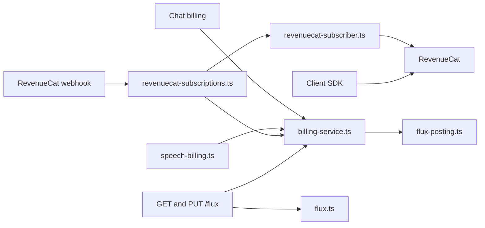
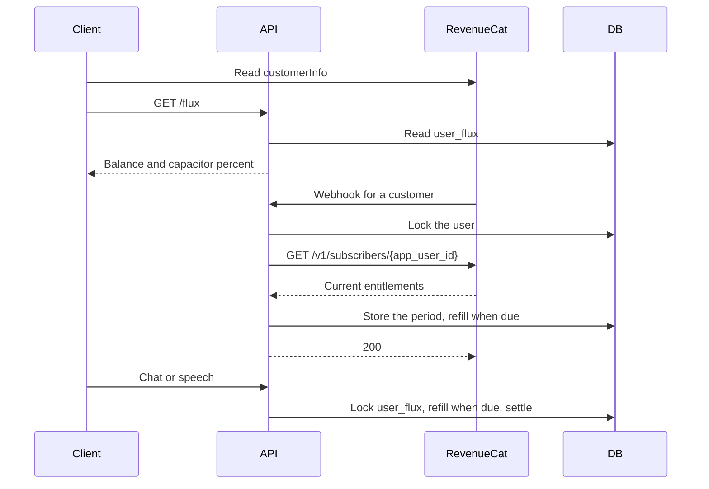

# The Capacitor

Status: accepted

## Decision

RevenueCat is the source for entitlement status.
The local database does not store subscription status and does not store webhook events.

The app reads `customerInfo` in the client SDK for the current Capacitor, expiry, and management URL.
The server reads `GET /v1/subscribers/{app_user_id}` to grant Capacitor Flux.

Capacitor Flux is a second bucket in the Flux wallet. It is not a second billing system.
`user_flux` holds both buckets in one row:

- `flux` is purchased Flux. It does not expire.
- `capacitor_flux` is Capacitor Flux. It refills to the quota at each reset boundary.
- `capacitor_quota`, `capacitor_expires_at`, and `capacitor_period_start` describe the current billing period.
- `capacitor_filled_at` is the time of the last refill.
- `capacitor_reset_at` is an admin reset time for this one wallet.
- `fallback_to_flux` chooses whether purchased Flux pays after Capacitor Flux runs out. The default is off.

One Flux equals 1,000,000 micro-Flux in both buckets.

### Spend

`postFluxUsage` is the only debit path.
It keeps the `flux_usage` idempotency and the wallet row lock.
Settlement takes whole Flux from the Capacitor first.
The rest comes from purchased Flux when the user has no active Capacitor or `fallback_to_flux` is on.
One fee can use both buckets.
A fee that no bucket can pay stays outstanding, as it did before.
A later Capacitor grant or credit pays it.

Admission uses the same rule. It counts the buckets that can pay now.

### Grant

The server does not select a rule from the webhook event type.
A webhook only tells the server that a customer changed.
The server reads the customer's entitlements and calls `BillingService.syncCapacitor`.
The latest purchase wins when two mapped Capacitors are active.

`syncCapacitor` stores the quota, the expiry, and the period start. It does not grant Flux directly.
The refill rule below decides the grant.
A smaller quota caps the bucket.
With no active Capacitor, `capacitor_expires_at` becomes now.

These rules cover purchase, renewal, product change, extension, expiration, refund, and transfer.
A repeated delivery or a late delivery gives the same result, so the server keeps no event log.
`TRANSFER` names its users in `transferred_from` and `transferred_to`. The server reconciles each of them.
A Capacitor without an expiry is not sold and does not grant Flux.

`syncCapacitor` holds a Postgres advisory lock for the user while it reads RevenueCat.
Two webhooks for one user cannot write an older answer after a newer answer.
The wallet row stays unlocked during the read, so debits continue.
The read has a 5-second timeout.

The server does not reconcile when `REVENUECAT_CAPACITORS` is unset or empty. The wallet stays as it is.
A sync with no products would expire every active Capacitor.
The webhook returns an error when the read fails or `REVENUECAT_API_KEY` is unset.
RevenueCat then sends the event again.
`TEST` events do not read RevenueCat.
RevenueCat sells Capacitors only. Flux packs stay on Stripe and Apple IAP.

### Refill

One rule fills the Capacitor.
A refill is due when `capacitor_filled_at` is before the reset boundary of an active Capacitor.
The boundary is the latest of these times:

- `capacitor_period_start`.
- The start of the current reset window, when `CAPACITOR_RESET_INTERVAL` is `day` or `week`. Windows count from the period start.
- `CAPACITOR_RESET_AT`, a one-time reset for every wallet.
- `capacitor_reset_at`, a one-time reset for one wallet.

A reset time in the future does not count until it passes.
A refill sets `capacitor_flux` to `capacitor_quota`. Unused Capacitor Flux is forfeit.
A boundary that is not later than the last refill does not refill.
Thus a return to an earlier billing period keeps the spent amount.

No job runs the refill.
Admission counts a due refill when it reads the wallet.
The next settlement writes the refill and its ledger row under the wallet row lock.
A reset for every wallet is one ConfigKV write.

The admin tools write `CAPACITOR_RESET_INTERVAL`, `CAPACITOR_RESET_AT`, and `capacitor_reset_at`.
This API has no admin route for them.

Capacitors are sold by the month. The client lists only packages with a monthly billing period.

A fee that the Capacitor cannot pay stays outstanding while the fallback is off.
The fallback switch does not cancel that fee.
The next refill pays it, or purchased Flux pays it after the Capacitor expires.
One request can exceed the balance by a small amount, the same as in the wallet before Capacitors.

### Expiry

Every read judges expiry. A Capacitor with a past `capacitor_expires_at` counts as 0.
No job clears it.

### Read

`GET /api/v1/flux` returns `capacitorPercent`, `capacitorRechargesAt`, and `fallbackToFlux` with the balance.
`capacitorRechargesAt` is the start of the next reset window. It is null without a reset interval, because the Capacitor then recharges only on renewal.
Windows count from each user's period start, so the client shows this time.
The percent is `capacitor_flux / capacitor_quota`. It is null without an active Capacitor.
The cached balance can show the amount before a reset for 60 seconds.
The response omits Capacitor Flux counts.
`PUT /api/v1/flux/fallback` saves `fallbackToFlux`.
Chat and speech do not call RevenueCat.

### Ledger

`flux_transaction.pool` is `wallet` or `capacitor`.
The balance columns of a row describe the bucket in `pool`.
A refill is a `credit` row in the Capacitor pool. Its `balanceBefore` is the forfeited Capacitor Flux.
A settlement that uses both buckets writes one `debit` row for each pool.
Purchased Flux capacity and `GET /flux/history` read only the wallet pool.

The web purchase SDK cannot replace a subscription in the app.
A subscriber opens the management URL to change Capacitors.
The webhook applies the new Capacitor Flux after the store changes the product.

## Scope

Remove the local subscription status mirror and the webhook event log.
Read entitlement status from RevenueCat on the client and on the server.
Keep Capacitor Flux in the Flux wallet.

## Non-goals

Capacitor Flux recall inside a period that stays active.
A reconciliation job without a webhook.
Showing Capacitor Flux amounts on the Capacitor cards.
Yearly Capacitors.
Flux packs through RevenueCat.
An admin route in this API for resets.
In-app product replacement checkout.
Expiry batches for purchased Flux.

## Module graph



## Sequence



## Affected files

```text
server/apps/api/
  drizzle/0032_capacitor.sql
  src/schemas/{flux,flux-transaction}.ts
  src/services/domain/billing/{billing-service,flux-posting}.ts
  src/services/domain/{flux,flux-cache,flux-transaction}.ts
  src/services/adapters/revenuecat-subscriber.ts
  src/services/adapters/revenuecat-subscriptions.ts
  src/routes/flux/index.ts
  src/routes/revenuecat/operations/webhook.ts
packages/stage-ui/src/stores/auth.ts
packages/stage-ui/src/composables/use-subscription.ts
packages/stage-pages/src/pages/settings/capacitor.vue
```

## Test plan

Run the Capacitor Flux tests for a new period, a known period, a changed period, an earlier period, no period, and expiry.
Run the reset tests for the interval window, the reset for every wallet, the reset for one wallet, and an expired Capacitor.
Run the settlement tests for the Capacitor-first order, a fee across both buckets, and the fallback switch.
Run the RevenueCat subscriber client tests for the response contract and upstream errors.
Run the RevenueCat subscription sync tests for Capacitor selection.
Run the webhook tests for a repeated event, `PRODUCT_CHANGE`, `EXPIRATION`, `TRANSFER`, and a failed read.
Run the flux route tests for the Capacitor percent and the fallback choice.
Run the client test that maps `customerInfo` to the current Capacitor.
