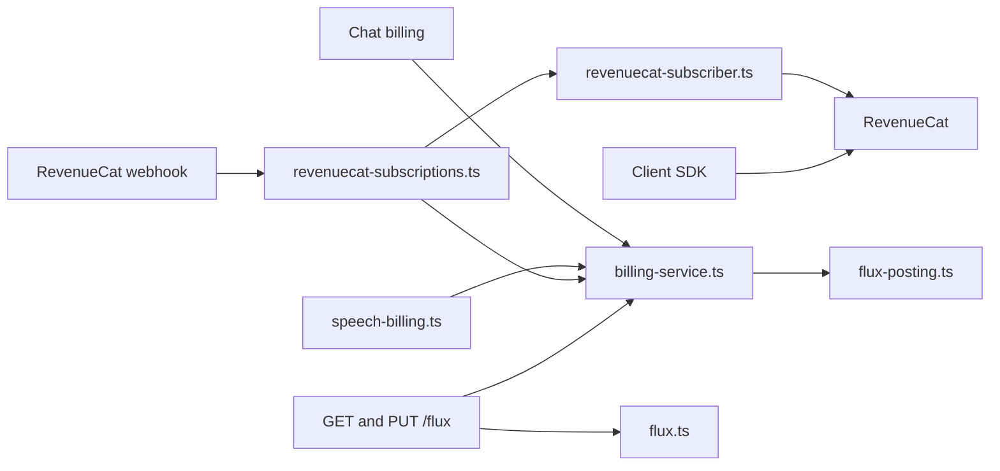
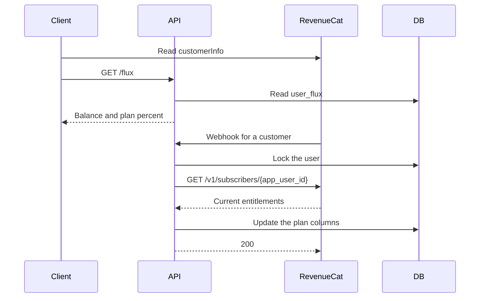

# Subscription plan Flux

Status: accepted

## Decision

RevenueCat is the source for entitlement status.
The local database does not store subscription status and does not store webhook events.

The app reads `customerInfo` in the client SDK for the current plan, expiry, and management URL.
The server reads `GET /v1/subscribers/{app_user_id}` to grant plan Flux.

Plan Flux is a second bucket in the Flux wallet. It is not a second billing system.
`user_flux` holds both buckets in one row:

- `flux` is purchased Flux. It does not expire.
- `plan_flux` is plan Flux. It resets each billing period.
- `plan_quota`, `plan_expires_at`, `plan_entitlement_id`, and `plan_period_start` describe the current period.
- `fallback_to_flux` chooses whether purchased Flux pays after plan Flux runs out. The default is off.

One Flux equals 1,000,000 micro-Flux in both buckets.

### Spend

`postFluxUsage` is the only debit path.
It keeps the `flux_usage` idempotency and the wallet row lock.
Settlement takes whole Flux from the plan bucket first.
The rest comes from purchased Flux when the user has no active plan or `fallback_to_flux` is on.
One fee can use both buckets.
A fee that no bucket can pay stays outstanding, as it did before.
A later plan grant or credit pays it.

Admission uses the same rule. It counts the buckets that can pay now.

### Grant

The server does not select a rule from the webhook event type.
A webhook only tells the server that a customer changed.
The server reads the customer's entitlements and calls `BillingService.syncPlan`.
The latest purchase wins when two mapped plans are active.

- The same entitlement and start time: only `plan_expires_at` changes.
- Another period: `plan_flux` resets to the quota. Unused plan Flux is forfeit.
- No active plan: `plan_expires_at` becomes now.

These rules cover purchase, renewal, product change, extension, expiration, refund, and transfer.
A repeated delivery or a late delivery gives the same result, so the server keeps no event log.
`TRANSFER` names its users in `transferred_from` and `transferred_to`. The server reconciles each of them.
A plan without an expiry is not sold and does not grant Flux.

`syncPlan` holds a Postgres advisory lock for the user while it reads RevenueCat.
Two webhooks for one user cannot write an older answer after a newer answer.
The wallet row stays unlocked during the read, so debits continue.
The read has a 5-second timeout.

The webhook returns an error when the read fails or `REVENUECAT_API_KEY` is unset.
RevenueCat then sends the event again.
`TEST` events do not read RevenueCat.
`NON_RENEWING_PURCHASE` settles a Flux pack and does not reconcile.

### Expiry

Every read judges expiry. A plan bucket with a past `plan_expires_at` counts as 0.
No job clears it.

### Read

`GET /api/v1/flux` returns `planRemainingPercent` and `fallbackToFlux` with the balance.
The percent is `plan_flux / plan_quota`. It is null without an active plan.
The response omits plan Flux counts.
`PUT /api/v1/flux/fallback` saves `fallbackToFlux`.
Chat and speech do not call RevenueCat.

### Ledger

`flux_transaction.pool` is `wallet` or `plan`.
The balance columns of a row describe the bucket in `pool`.
A plan grant is a `credit` row in the plan pool. Its `balanceBefore` is the forfeited plan Flux.
A settlement that uses both buckets writes one `debit` row for each pool.
Purchased Flux capacity reads only the wallet pool.

The web purchase SDK cannot replace a subscription in the app.
A subscriber opens the management URL to change plans.
The webhook applies the new plan Flux after the store changes the product.

## Scope

Remove the local subscription status mirror and the webhook event log.
Read entitlement status from RevenueCat on the client and on the server.
Keep plan Flux in the Flux wallet.

## Non-goals

Plan Flux recall inside a period that stays active.
A reconciliation job without a webhook.
Showing plan Flux amounts on the plan cards.
Folding a 12-month price into a yearly price.
In-app product replacement checkout.
Expiry batches for purchased Flux.

## Module graph



## Sequence



## Affected files

```text
server/apps/api/
  drizzle/0031_plan_flux.sql
  src/schemas/{flux,flux-transaction}.ts
  src/services/domain/billing/{billing-service,flux-posting}.ts
  src/services/domain/{flux,flux-cache,flux-transaction}.ts
  src/services/adapters/revenuecat-subscriber.ts
  src/services/adapters/revenuecat-subscriptions.ts
  src/routes/flux/index.ts
  src/routes/revenuecat/event.ts
  src/routes/revenuecat/operations/webhook.ts
packages/stage-ui/src/stores/auth.ts
packages/stage-ui/src/composables/use-subscription.ts
packages/stage-pages/src/pages/settings/plan.vue
```

## Test plan

Run the plan Flux tests for a new period, a known period, a changed period, no period, and expiry.
Run the settlement tests for the plan-first order, a fee across both buckets, and the fallback switch.
Run the RevenueCat subscriber client tests for the response contract and upstream errors.
Run the RevenueCat subscription sync tests for plan selection.
Run the webhook tests for a repeated event, `PRODUCT_CHANGE`, `EXPIRATION`, `TRANSFER`, and a failed read.
Run the flux route tests for the plan percent and the fallback choice.
Run the client test that maps `customerInfo` to the current plan.
