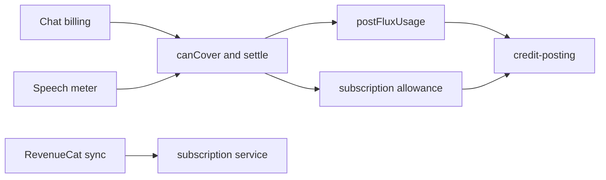
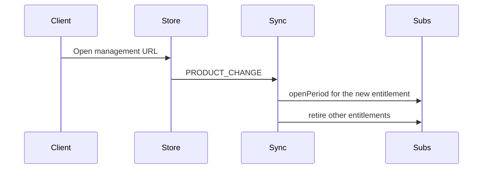

# Subscription Credits and plan changes

Status: accepted

## Decision

Plan Credits and the Flux wallet share one posting scale.
One Credit equals one Flux and 1,000,000 micro-Credits.
`credit-posting.ts` owns the pool math.
Chat and speech call `canCover` and `settle`.
The earliest open Credit period pays when it covers the whole fee.
Otherwise the Flux wallet pays when Flux fallback is on.
Each pool must cover the whole fee alone.
`spendableMicro` is the remaining balance of that earliest period.

`INITIAL_PURCHASE`, `RENEWAL`, and `PRODUCT_CHANGE` open a new Credit period and forfeit the old remainder.
Those events expire every other entitlement for that user.
`UNCANCELLATION` keeps the current Credit period.
`SUBSCRIPTION_EXTENDED` moves the open period end later and keeps the remainder.

The web purchase SDK cannot replace a subscription in the app.
A subscriber opens the management URL to change plans.
The webhook applies the new Credits after the store changes the product.

`GET /status` returns `remainingPercent` for each allowance.
The response omits Credit counts.
Billing still reads the ledger inside the server.

## Scope

Replace integer plan debits with micro-Credit debits.
Speech uses the same settlement as chat.
A product change retires the previous entitlement.

## Non-goals

Showing Credit amounts on the plan cards.
Folding a 12-month price into a yearly price.
In-app product replacement checkout.

## Module graph



## Sequence



## Affected files

```text
server/apps/api/
  drizzle/0031_subscription.sql
  src/schemas/subscription.ts
  src/services/domain/billing/credit-posting.ts
  src/services/domain/billing/credit-settlement.ts
  src/services/domain/billing/speech-billing.ts
  src/services/domain/subscriptions/index.ts
  src/services/adapters/revenuecat-subscriptions.ts
  src/routes/openai/v1/middlewares/billing.ts
  src/routes/subscriptions/index.ts
```

## Test plan

Run the subscription service tests.
Run the RevenueCat subscription sync tests.
Run the Flux usage tests, including speech that plan Credits cover.
Run the usage settlement tests for plan, wallet, unbilled, and replay.
Run the OpenAI route test that spends plan Credits before the wallet.
Run the subscription route test that returns `remainingPercent` and omits Credit counts.
