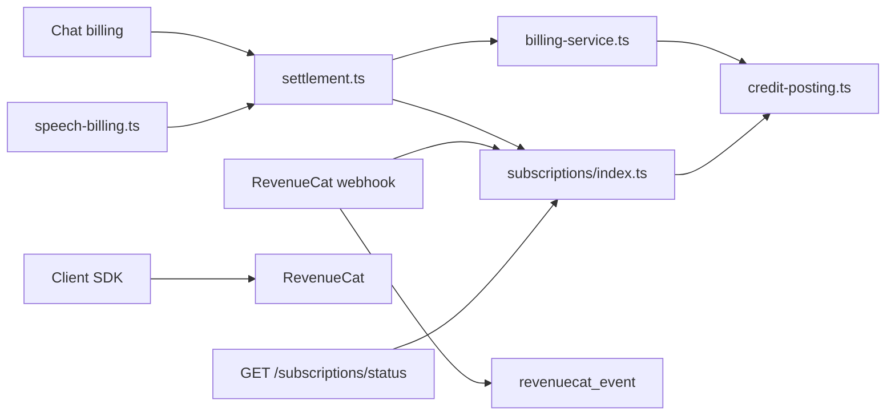
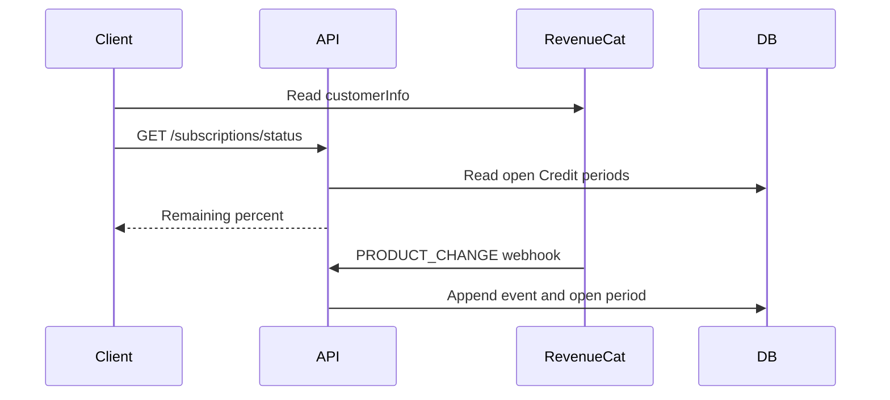

# Subscription Credits and plan changes

Status: accepted

## Decision

The client RevenueCat SDK is the source for entitlement status.
The app reads `customerInfo` for the current plan, expiry, and management URL.
The local database does not store subscription status.

`revenuecat_event` is an append-only log of webhook events.
`event_id` is unique.
A duplicate event returns 200 and does not run again.

Plan Credits stay local.
`INITIAL_PURCHASE`, `RENEWAL`, and `PRODUCT_CHANGE` open a new Credit period and forfeit every other open period for that user.
A late event with an earlier period start is stored closed.
The grant uses only that event's own times.
`UNCANCELLATION`, `CANCELLATION`, `EXPIRATION`, `BILLING_ISSUE`, `SUBSCRIPTION_EXTENDED`, and `TRANSFER` are logged only.
A refund does not take Credits back.

`GET /subscriptions/status` returns the local remaining percent and the Flux-fallback preference.
It does not return entitlements.
Chat and speech do not call RevenueCat.
They debit the local Credit ledger.

Plan Credits and the Flux wallet share one posting scale.
One Credit equals one Flux and 1,000,000 micro-Credits.
`credit-posting.ts` owns the pool math.
Chat and speech call `canCover` and `settle`.
The earliest open Credit period pays when it covers the whole fee.
Otherwise the Flux wallet pays when Flux fallback is on.
Each pool must cover the whole fee alone.
`spendableMicro` is the remaining balance of that earliest period.

The web purchase SDK cannot replace a subscription in the app.
A subscriber opens the management URL to change plans.
The webhook applies the new Credits after the store changes the product.

`GET /status` returns `remainingPercent` for each allowance.
The response omits Credit counts.
Billing still reads the ledger inside the server.

## Scope

Remove the local subscription status mirror.
Read entitlement status in the client SDK.
Keep Credit grants and debits in Postgres.

## Non-goals

Credit recall on refund.
A `TRANSFER` account merge.
A reconciliation job.
Showing Credit amounts on the plan cards.
Folding a 12-month price into a yearly price.
In-app product replacement checkout.

## Module graph



## Sequence



## Affected files

```text
server/apps/api/
  drizzle/0031_subscription.sql
  src/schemas/subscription.ts
  src/services/domain/billing/credit-posting.ts
  src/services/domain/billing/settlement.ts
  src/services/domain/billing/speech-billing.ts
  src/services/domain/subscriptions/index.ts
  src/services/adapters/revenuecat-subscriptions.ts
  src/routes/openai/v1/middlewares/billing.ts
  src/routes/revenuecat/operations/webhook.ts
  src/routes/subscriptions/index.ts
packages/stage-ui/src/composables/use-subscription.ts
packages/stage-pages/src/pages/settings/plan.vue
```

## Test plan

Run the subscription service tests, including forfeit and out-of-order grants.
Run the RevenueCat subscription sync tests.
Run the webhook tests for a duplicate event and a Credit grant.
Run the client test that maps `customerInfo` to the current plan.
Run the Flux usage tests, including speech that plan Credits cover.
Run the usage settlement tests for plan, wallet, unbilled, and replay.
Run the OpenAI route test that spends plan Credits before the wallet.
Run the subscription route test that returns `remainingPercent` and omits Credit counts.
