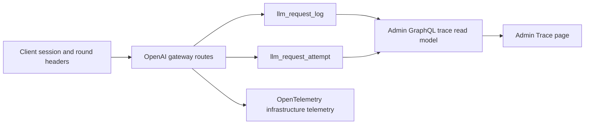
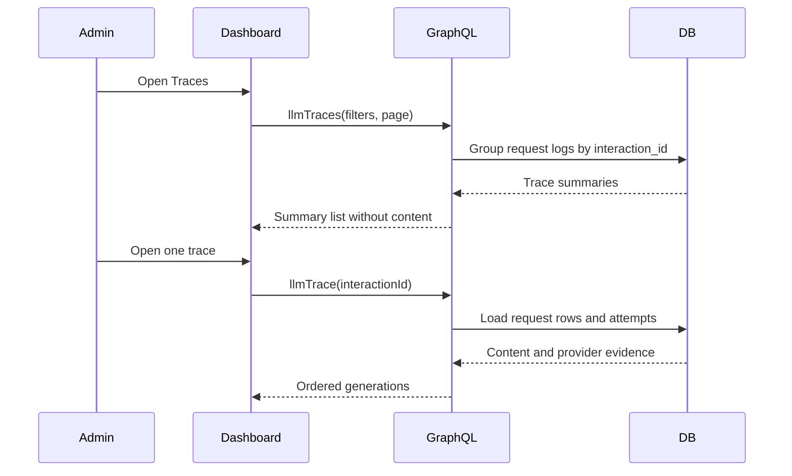

# Admin agent traces from request logs

Status: accepted

## Decision

The admin Trace page reads agent turns from `llm_request_log`.
One trace is one non-empty `interaction_id`.
One generation is one request log row.
One upstream attempt is one `llm_request_attempt` row.

The request log remains the source of prompt, completion, model, token, provider, status, and timing data.
The admin API groups these rows for the Trace page.
This change adds no trace table and no second write path.

Remove the Langfuse exporter and its generation wrapper from the API.
Keep the OpenTelemetry pipeline for infrastructure traces, metrics, and logs.
OpenTelemetry does not receive prompt or completion content.

## Boundary

```text
client session ID      -> llm_request_log.session_id
client round ID        -> llm_request_log.interaction_id
LLM gateway request    -> llm_request_log
upstream dispatch      -> llm_request_attempt
admin Trace page       -> grouped read model
```

The client already sends the session ID and round ID.
The API does not need a new client event for the first Trace page.
A future client event is required for exact tool runtime, ASR, TTS playback, and local IO timing.

## Scope

- Remove the Langfuse packages, exporter setup, and generation calls.
- Add admin queries for trace summaries and trace details.
- Group requests by `interaction_id` without copying rows.
- Show complete request content only in trace details.
- Add navigation between sessions, traces, and requests.

## Non-goals

- Do not add client IOTrace upload.
- Do not infer exact tool duration or tool success.
- Do not put prompt or completion content in OpenTelemetry spans.
- Do not migrate historical data.
- Do not change request billing or routing.

## Module graph



## Affected files

```text
server/apps/api/
  instrumentation.ts
  package.json
  README.md
  src/routes/openai/v1/
  src/services/domain/openai-speech/
  src/services/domain/llm-tracing/ (remove)
server/docs/ai/adr/2026-10-05-admin-agent-traces.md
pnpm-lock.yaml

proj-airi/backend/
  api/graphql/admin/schema/llm.graphqls
  internal/models/llmlog/
  internal/graphql/admin/resolver/

proj-airi/admin-dashboard/
  src/graphql/llm.graphql
  src/pages/observability/
  src/components/observability/
  src/components/admin/navigation.ts
  src/router.ts
```

## Read sequence



## Rollout

Deploy the admin API before the dashboard.
The old dashboard does not call the new fields.
Deploy the AIRI API after the Trace page is available.
Removing Langfuse stops new external observations but does not delete existing Langfuse data.

Rollback the AIRI API to restore Langfuse export.
Rollback the dashboard independently if the new read model has a problem.
No database rollback is necessary.

## Verification

- Test trace grouping, filters, paging, sorting, failed counts, tokens, and models.
- Test that trace details return generations in time order with request content and attempts.
- Run GraphQL generation and Go tests.
- Run dashboard GraphQL generation, unit tests, typecheck, and build.
- Verify session-to-trace, trace-to-request, and request-to-trace navigation in a browser.
- Run the API tests that cover chat, Responses, and speech routes after Langfuse removal.
