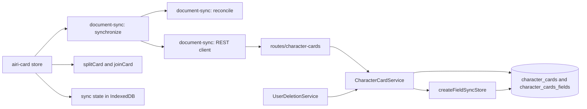
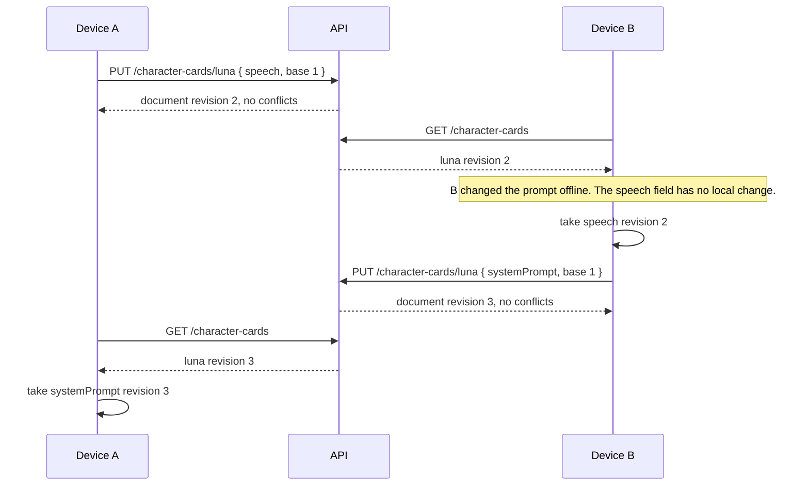

# Document synchronization by field

Status: accepted

## Context

A client keeps its character cards in local storage. A card does not reach the other devices of the user.
Chat synchronization stores the local card id in each chat member.
A second device receives the chats but has no card with that id.
Other client data has the same need, so the conflict rules must be reusable.
A shared table for all features does not fit. Each feature has its own limits, indexes, retention, and validation.

## Decision

The server and the client share an algorithm, not a table.
Each feature owns its tables and its routes. The server provides a store that works on the tables of any feature.

A document is a set of independent fields. The client mints the document id, and the server keeps it.
The client of a feature selects its fields. The store does not read field keys or values.
The feature validates the content before the store writes it.

Each document has a `revision` counter. An accepted write increases it.
A field stores the document revision of its last change.
A push gives a `baseRevision` for each field. The store accepts the field if the stored revision is equal.
The store accepts the other fields of the same push. It returns the keys that it did not accept.
Devices that change different fields of one document do not conflict.

The design does not use a CRDT. A value is a selection or a full text, and a merge of two texts gives a result that no user wrote.

## Server modules

| Module | Owner | Responsibility |
| --- | --- | --- |
| `FieldSyncTables` | Shared | A type that lists the columns the store needs. The compiler rejects a table that misses one. |
| `createFieldSyncStore(db, tables, { validate })` | Shared | Locks a document, compares revisions, writes the accepted fields, keeps deletion markers, and removes the content of a deleted account. |
| `parseDocumentId`, `parsePushRequest`, `parseDeleteRevision` | Shared | Parse the three request shapes. |
| Tables, service, routes, and `validate` of a feature | Feature | Declare the two tables by hand in its own schema file. Choose the route, the extra columns and tables, the limits, the authorization, and every rule about the content. |

A feature composes the store in its own route. The store gives no routes and no hooks other than `validate`.
A feature can add other routes to the same path, for example a signed upload address for a file.

A feature can add columns and indexes to its tables. An added column must accept `null` or have a default.
The store inserts a document row with only the two key columns, and the compiler does not catch a required column.
For a required value, the feature uses a field, or another table with the key `(ownerId, documentId)`.

## Conflict rules

| Case | Result |
| --- | --- |
| One side changed a field | That change applies. |
| Both sides changed a field to the same value | No write. |
| Both sides changed a field to different values | The remote value applies. The client keeps the local document as a new document. |
| One side deleted the document, and the other side edited it | The edit applies, and the document stays. |
| A document that each device creates with the same id | The device sends only the parts that differ from the built-in content, so an unedited document sends nothing. The other devices lay the received parts over their own built-in content. The conflict rules apply to the parts that both sides edited. |

## Character cards

The tables are `character_cards` and `character_cards_fields`. The route is `/api/v1/character-cards`.
A field key is an RFC 6901 JSON Pointer into the card. The service rejects a key that does not start with `/`.
The client makes one field for each first-level key of the card.
It also makes one field for each key of `extensions`, `extensions.airi`, and `extensions.airi.modules`.
The settings of one module stay in one field, so a provider and its voice change together.
A card stores provider ids and no credentials.
The selected card is not synchronized. Each device keeps its own selection.
The `default` card is built in. Each device creates it in its own language, so a part that equals the built-in card never leaves the device. The device lays the received parts over its own built-in card.
The service accepts a field when its key is a JSON Pointer. For the keys that the client reads without a further check, such as `/name`, `/tags`, and `/extensions/airi/wakeWords`, the value must also have the expected type. A value of another type would make the card fail on every device. Other keys accept any JSON, because cards from other applications carry their own extensions.
A device that cannot read a card keeps the cards that it can read and does not delete the server copy of the unreadable card.
An account can store 200 cards and 16 MiB of field values. A deleted card does not count. The limits come from the size of a card, which is a few kilobytes. A card with a large lorebook can reach a few hundred kilobytes.
The card list shows the cloud state of each card: synced, waiting to upload, or refused by the server. A signed-in user also sees one line that tells that the cards sync to the account. A user without an account sees neither.

## Scope

- The shared store, the table contract, and the request parsers.
- The character card tables, service, and routes.
- Account deletion removes the card content and keeps the deletion markers.
- A client module that compares, merges, and sends documents for any route of this shape.
- The client runs after sign-in, after a card change, and when a window becomes visible. The `airi-card` store owns the runs, as the provider and chat stores own theirs. The synchronization leader executes one run at a time.
- Before each request, a run checks that the account has not changed. A request reads the token when it starts, so an account change would otherwise send the documents of the old account to the new account.

## Known limits

- A field value is plain JSON. A card from another application can carry any content in `extensions`, and the client uploads it so that an imported card keeps its extensions on every device. The client does not filter it. A user must not put a secret in a card.
- The account deletion removes the content in one transaction. A push that is already in flight can write content back before the account is gone. The handlers of other services have the same order, so this design keeps it.
- A removed field leaves no row, so its revision is zero again. A device with a field revision of zero has never seen the field, and its new value is a new field. A device that has seen the field sends the old revision, and the server reports a conflict. No sequence of requests lets a device overwrite a revision that it has seen.
- The server has no rate limit for these routes, and the list is not paginated.

## Non-goals

- Provider configurations and chat messages. Their current synchronization does not change.
- Encrypted storage. A feature with secrets needs it first.
- Display model files. A card synchronizes its `displayModelId` only. A later feature stores the files in object storage and uses this store for their descriptions.
- Contacts, group chats, and the binding of a chat to a contact.
- A read-only built-in card. When it exists, the built-in card leaves synchronization and its forks synchronize as ordinary cards.
- A history of the changes to a card. A conflict keeps the losing version as a copy, and a deleted card loses its content on the server.
- A push channel. Another device receives a change on its next run.
- Pagination. A run reads all documents of the feature.
- The relational `characters` tables and their routes. They do not change.
- Removal of old deletion markers.

## HTTP contract of a feature

The character card routes are the reference.

| Request | Result |
| --- | --- |
| `GET /` | `{ documents }`. A deleted document has `deletedAt` and no fields. |
| `PUT /:id` with `{ fields }` | `{ document, conflicts }`. A field is `{ key, baseRevision, value }` or `{ key, baseRevision, removed: true }`. |
| `DELETE /:id?revision=N` | `204`. `409` if the document revision is not `N`. |

A push to a deleted document restores the document when the store accepts a field.
A push that changes nothing is valid, so a client can send a push again after a lost response.
A store with limits answers 413 with the code `STORAGE_LIMIT_EXCEEDED` when a push makes the account grow past a limit, and it writes nothing of that push. A push that does not grow the account always passes, so an account over its limit can still delete and shrink. The check runs under a lock for the account, so two requests cannot both take the last free slot.
A client treats 400 and 413 for one document as a refusal of that document. The run goes on with the other documents, and the next run sends the refused document again. Other failures stop the run.
A value must not be `null`. A missing field row represents an absent value.

## Module graph



## Affected files

```text
server/apps/api
├── drizzle/0031_character_cards.sql
└── src
    ├── app.ts
    ├── schemas/character-cards.ts       # the tables of the feature, declared by hand
    ├── services/domain/field-sync/      # the shared store, the table contract, and request parsers
    ├── services/domain/character-cards.ts
    └── routes/character-cards/index.ts
packages/stage-ui/src
├── libs/document-sync/{client,reconcile,synchronize}.ts
├── libs/character-card-sync/card-fields.ts
├── database/repos/document-sync.repo.ts
└── stores/modules/airi-card.ts         # starts the runs and applies the result
```

## Sequence



## Client state

The client stores the fields and revisions that it last merged, for each feature and account.
A local field that differs from this state has a local change.
A remote field whose revision differs from this state has a remote change.
The local cards belong to the device. A second account on the device starts without sync history and uploads them.

## Test plan

- Store tests on PGlite with tables that no feature owns, and with extra columns: field independence, conflicts, a repeated push, deletion, restoration, validation, account deletion, and the kept extra columns.
- Character card tests: the tables, the key check, and the routes with their status codes.
- Client unit tests: each conflict rule, the built-in document, the REST client, and the card split.
- Browser test with two profiles of one account: create, edit, and delete a card.
