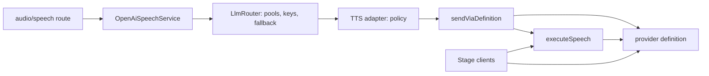
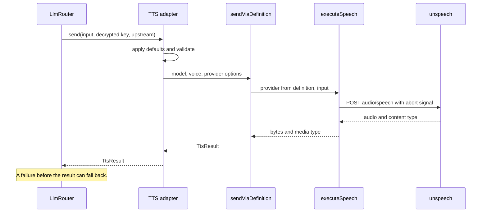

# Shared provider runtime for hosted inference

Status: proposed

Issue: https://github.com/moeru-ai/airi/issues/2830

## Decision

The hosted API runs a provider through the same code as the Stage clients.
`@proj-airi/provider-inference` owns provider definitions and the execution functions.
The server does not add a second package for execution.

`executeSpeech(provider, input)` runs one batch speech request on any provider instance.
It returns the audio bytes and the media type that the provider response declares.
It accepts provider options and a fallback `fetch`.
It does not select a provider, read credentials, retry, or bill.

The hosted TTS router keeps route selection, key rotation, fallback, concurrency, tracing, and billing.
Each TTS adapter keeps its policy: defaults, request validation, and the voice catalog.
For each attempt, the adapter creates a provider from a shared definition and the decrypted key.
It then calls `executeSpeech` through `sendViaDefinition`.

| Route id in `LLM_ROUTER_CONFIG` | Shared definition |
| --- | --- |
| `dashscope-cosyvoice` | `alibaba-cloud-model-studio` |
| `stepfun` | `stepfun-speech` |

The route ids do not change, so the production config does not change.

## Boundary



| Owner | Responsibility |
| --- | --- |
| `provider-inference` | Definitions, provider creation, `executeSpeech`, `SpeechUpstreamError`. |
| `llm-router` | Pool choice, key rotation, per-attempt timeout, fallback before output. |
| TTS adapter | Defaults, request validation, mapping of voice pack options, voice catalog. |
| `sendViaDefinition` | Provider creation, `executeSpeech`, mapping of provider errors to `TtsUpstreamResponseError`. |
| `OpenAiSpeechService` | Admission, billing, tracing, response headers. |

## Scope

- Batch TTS for the two providers that production uses.
- A `stepfun-speech` definition. It is not in `portableProviderDefinitions` because Stage has no settings page for it yet.
- Removal of the Azure and Volcengine REST adapters. The production config does not reference them.
  The Stage clients keep the `microsoft-speech` and `volcengine` definitions.
- Removal of the decrypted key and region from the voice catalog context. Only Azure used them.

## Non-goals

- Batch ASR. The hosted API has no batch transcription route.
- Realtime TTS and realtime ASR. They need a session contract and their own ADR.
- A new `runtime` field on definitions. `isAvailableBy` and the Node.js runtime matrix test already cover it.
- Voice catalog migration. The adapters keep the unspeech voice list because the definitions drop fields such as formats and the model filter.
- A Stage settings page for StepFun.
- Changes to the public `/audio/speech` request and response.

## Invariants

- Fallback happens only before the router returns audio bytes to the caller.
- A caller abort reaches the provider request and never starts another attempt.
- The decrypted key lives only for one attempt and is cleared after it.
- Provider definitions do not read ConfigKV, the environment, or a session.
- A provider response with an HTTP status keeps that status for the fallback decision.

## Known gaps

- unspeech 0.1.16 declares `createUnStepfun` in its types but does not export it.
  `patches/unspeech@0.1.16.patch` adds the export. Remove the patch when a published version has it.
- The router still identifies a capacity pool by `adapterParams.appid`, which is a Volcengine name.
  No remaining adapter needs it. Rename it in a later change.

## Affected files

```text
patches/unspeech@0.1.16.patch
server/apps/api/Dockerfile
packages/provider-inference/src/
  speech.ts
  speech.test.ts
  index.ts
  providers/cloud/unspeech/index.ts
  providers/cloud/unspeech/stepfun.test.ts
  providers/cloud/openrouter-audio-speech/index.ts
server/apps/api/src/services/
  adapters/tts/definition.ts
  adapters/tts/dashscope-cosyvoice.ts
  adapters/tts/stepfun.ts
  adapters/tts/{index,types,unspeech}.ts
  adapters/config-kv/definitions.ts
  domain/llm-router/router.ts
server/docs/ai/adr/2026-10-07-shared-provider-runtime.md
```

Deleted: `adapters/tts/azure.ts` and `adapters/tts/volcengine.ts`.

## Attempt sequence



## Test plan

- `executeSpeech` returns bytes and media type, reports a non-2xx status, honors a caller abort, and passes provider options.
- The `stepfun-speech` definition prefixes the model and sends each option as an `extra_body` field.
- The Dashscope and StepFun adapters keep their request body, headers, voice defaults, and voice pack handling.
- The router tests for fallback, pools, and voice catalog cache run on the remaining adapters.

## Open items

- Decide the session contract for realtime providers in a separate ADR.
- Add a Stage settings page for StepFun.
- Move the voice catalogs to the definitions after the definitions return the same fields.
