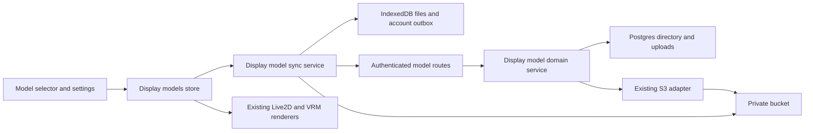
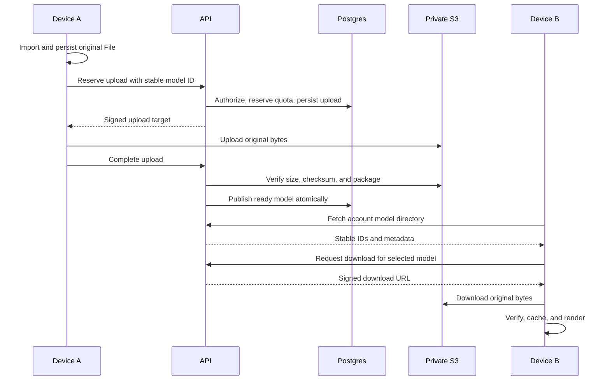

# Private display model cloud sync

Status: proposed

## Problem and current evidence

Imported display models use localforage in `packages/stage-ui/src/stores/display-models.ts`.
Built-in models use stable preset IDs and bundled URLs.
The AIRI card module references a model through `displayModelId`.
That reference does not transfer the model bytes to another device.
The stage model store replaces missing selections with the default model.
Cloud models need separate states for missing bytes and missing records.

The API already provides a private S3 transport and 900-second signed URLs.
It does not provide a display model directory, authorization policy, or upload completion protocol.
The existing `avatar_model` table belongs to hosted characters.
Private display model assets need an independent lifecycle because several cards can reference one model.

## Proposed decision

Use a private account model directory in Postgres, original model files in S3, and device caches in IndexedDB.
Reuse the existing AWS SDK and object store adapter.
Do not add a general asset framework or replace device storage in this change.

Assume users enable automatic sync for new imports.
Let users select existing local models for upload.
Fetch metadata after login and download bytes when users select a model.
Keep local imports and cached models usable offline.
Confirm this product choice before implementation.

## Scope

- Support imported Live2D ZIP files and VRM files.
- Preserve Live2D archive paths, textures, expressions, motions, and settings.
- Keep preset models bundled and reference their existing IDs.
- Store thumbnails as optional separate objects. Thumbnail failure does not block model availability.
- Support rename, local cache removal, cloud deletion, retry, and account switching.
- Preserve existing local model IDs when users upload old imports.
- Reject a same-ID upload with different bytes. Replacement creates a new model ID.
- Keep card references as stable model IDs. Never persist signed URLs or object URLs.

Directory import, public sharing, marketplace publication, other model formats, and rendering settings sync are separate work.
Live2D directory support requires a complete archive export first. An OPFS handle is not a portable model package.

## Contracts and ownership

Proposed `display_models` fields:

`id`, `owner_id`, `format`, `name`, `original_filename`, `object_key`, `byte_size`, `sha256`,
`preview_object_key`, `status`, `revision`, `created_at`, `updated_at`, `deleted_at`.

Proposed `display_model_uploads` fields:

`id`, `model_id`, `owner_id`, `request_id`, `object_key`, `expected_size`, `expected_sha256`,
`reserved_bytes`, `expires_at`, `status`.

Use database transactions and unique constraints for quota reservation and idempotency.
Use revision checks for metadata updates. Return conflicts instead of silently replacing newer edits.
Keep local transfer progress separate from server readiness.
Local states include local-only, queued, uploading, synced, cloud-only, downloading, and failed.

Suggested keys:

```text
display-models/{ownerId}/{modelId}/{uploadId}/original.zip
display-models/{ownerId}/{modelId}/{uploadId}/original.vrm
display-models/{ownerId}/{modelId}/{uploadId}/preview.png
```

The server creates keys. Client paths never determine keys.
Every list, upload, complete, download, rename, and delete request requires account ownership.
Private model access does not follow public character visibility.

Proposed endpoints:

| Operation | Endpoint |
| --- | --- |
| List account metadata, with pagination and deletion markers | `GET /api/display-models` |
| Reserve quota and obtain an upload target | `POST /api/display-models/uploads` |
| Verify bytes and publish a ready record | `POST /api/display-models/uploads/:id/complete` |
| Obtain a temporary download URL | `POST /api/display-models/:id/download` |
| Rename with an expected revision | `PATCH /api/display-models/:id` |
| Delete with an expected revision | `DELETE /api/display-models/:id` |

Validate HTTP contracts with Valibot beside their owners.
The API carries metadata. Model bytes go directly between the client and S3.

## Upload integrity and lifecycle

An upload completion request does not prove that valid bytes exist.
Check object size and an S3-validated checksum before publishing readiness.
Client-written hash metadata alone does not prove integrity. Do not treat ETag as SHA-256.
Validate format signatures and bounded archive structure before readiness.
Bound compressed size, expanded size, entry count, and resource paths for Live2D packages.
Check referenced model resources with the existing validation rules.

Signed upload URLs remain usable until expiry. Prevent overwrites of ready bytes.
First verify checksum signing and conditional write support on the actual S3 provider.
Use write-once uploads when the provider supports the required contract.
If it does not, choose a staging-to-final copy design before implementation.
That design requires an explicit copy operation in the transport adapter.
Do not silently accept mutable ready objects.

Delete metadata through a tombstone before object removal.
Persist failed deletion work so another request or an external maintenance job can retry it.
Do not add API background loops or fire-and-forget cleanup.
Delay physical removal until outstanding upload URLs expire.
Use an external maintenance command for expired reservations and orphan objects.
Integrate account deletion with the same durable removal path.

## Client behavior

Persist the local file before queueing upload. A failed local write is an import failure.
Persist upload work by account and model ID. Resume pending work after restart.
Capture the authenticated account and an account generation for every transfer.
After account switching, cancel transfers and reject stale completion callbacks.
Keep downloaded private caches scoped to their owner. Local-only imports remain device-owned.

Download to a temporary cache entry, verify size and SHA-256, then publish the local file.
Feed the cached File through the existing Live2D and VRM rendering paths.
Distinguish cloud-only, downloading, offline-unavailable, deleted, and invalid models.
Do not replace a cloud-only selection with the default model during download.

Local cache removal does not delete the cloud model.
Cloud deletion requires explicit selection in the UI.
If cards reference the model, require detachment or reject deletion with the affected card list.
Offline devices receive deletion markers during their next directory reconciliation.

## Module dependencies



## Implementation notes

Upload mechanics are generic. The model domain only decides format, quota, and publication.

- `upload_sessions` stores one reservation per `(owner, purpose, requestId)`. The server sets `purpose` and the object key.
- `UploadSessionService` signs a write-once PUT, verifies size, store-validated SHA-256, and file signature, and marks completion.
- The signed PUT carries `x-amz-checksum-sha256` and `If-None-Match: *`. Wrong bytes and second writes fail at the store.
- `TransferQueue` (client) persists tasks per account, retries after restart, and drops results after an account change.
- Defaults until confirmed: 512 MiB per file, 2 GiB per account, sync starts after sign-in, upload of old imports is manual.
- Deletion writes a tombstone. Physical object removal needs the external cleanup command, which is not part of this change.
- Conditional writes and checksum signing are not verified on the production provider.
- Package-level Live2D validation, card reference checks on delete, and stage-pocket acceptance are follow-up work.

## Affected files

```text
packages/stage-ui/src/
├── stores/display-models.ts                           [extend]
├── stores/settings/stage-model.ts                     [extend]
├── services/display-model-sync.ts                     [new, API client]
├── libs/file-transfer/                                [new, generic transfer and queue]
└── components/scenarios/dialogs/model-selector/       [extend]
server/apps/api/
├── src/routes/display-models/                         [new]
├── src/services/domain/display-models.ts              [new]
├── src/services/domain/upload-sessions.ts             [new, generic]
├── src/schemas/display-models.ts                      [new]
├── src/services/adapters/object-store.ts              [extend if required]
├── src/app.ts                                        [extend]
└── drizzle/                                          [new migration]
packages/i18n/src/locales/{en,zh-Hans}/                 [extend]
```

## Sequence



## Delivery plan and acceptance

1. Confirm sync policy, supported clients, file limits, quota, and deletion behavior.
2. Verify actual provider CORS, checksums, conditional writes, and large-file transfer behavior in an isolated bucket.
3. Implement account directory, upload reservation, readiness verification, and authorized download.
4. Connect imports to a durable client outbox. Upload existing selected models without changing their IDs.
5. Connect cloud-only selections to verified downloads and existing renderers.
6. Add rename conflicts, deletion markers, account isolation, and durable cleanup.
7. Verify two clean clients using one account with a real Live2D package and a real VRM file.

Acceptance includes renderer output, Live2D textures and motions, restart recovery, offline cached use, and visible transfer errors.
Exercise URL expiry, corrupt bytes, duplicate completion, quota races, referenced deletion, and logout during transfer.
Verify unauthorized model IDs cannot obtain upload or download targets.
Verify production and test buckets remain isolated.

Run changed workspace typechecks and related tests, root `pnpm typecheck`, and `pnpm lint` during implementation.
Run browser and Electron acceptance separately. A web result does not prove Electron behavior.
Use real model sizes to decide whether single PUT is sufficient or multipart upload belongs in the initial scope.

## Open decisions

- Automatic sync after opt-in versus per-model manual uploads.
- Stage-web and stage-tamagotchi first versus stage-pocket in the same release.
- Maximum file size, account quota, and transfer concurrency.
- Provider-supported immutable upload strategy.
- Retention period for deletion markers and private device caches after logout.

This planning task changes no application code or production configuration.
Provider behavior and deployed bucket configuration remain unverified in this task.
