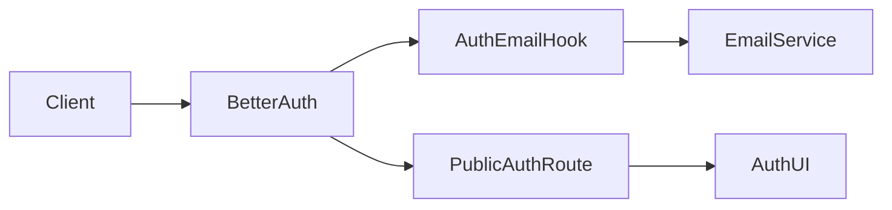
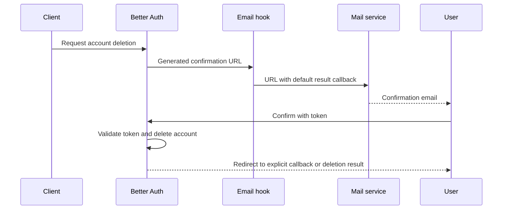
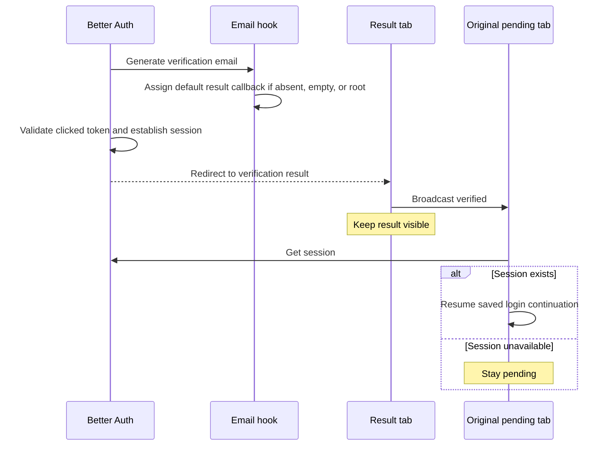

# Account email confirmation results

Status: accepted

## Context and decision

A deletion email with `callbackURL=/` completes the operation, then sends the user to the API root without a result message.
The auth service owns the default result destination as permanent public behavior.
Before email delivery, it replaces an absent, empty, or `/` callback with its public `/auth/delete-account` route.
Explicit callback destinations remain unchanged. Better Auth keeps responsibility for token and callback validation.
The public route uses the configured Auth UI deployment and preserves environment routing.

## Scope

This change affects newly generated deletion and registration verification emails. It does not change existing emails, token expiry, authorization, or data deletion.
Verification emails use `/auth/verify-email?verified=true` for absent, empty, or root callbacks. Explicit callbacks remain unchanged.
The verification result tab stays visible and broadcasts success. Only the original pending tab resumes its login flow after a session check.
The confirmation email remains required. The result page alone does not prove deletion.

## Dependencies



## Affected files

```text
server/apps/auth/src/
  auth.ts
  tests/auth.test.ts
apps/ui-server-auth/src/pages/
  verify-email.vue
server/docs/ai/adr/
  2026-10-09-account-deletion-email-result.md
```

## Sequence



## Verification

Hook tests capture the delivered URL and preserve its token and other query parameters.
Cases cover absent, empty, and root callbacks, plus explicit relative and absolute destinations.
Existing auth tests cover the deletion hook order. No production account deletion is part of these checks.
After deployment, request a new email with a disposable account and complete the flow on a physical device.

## Registration verification



Verification hook tests cover the same six callback cases as deletion.
Local browser checks mount the real page with English translations and repository UnoCSS.
A local session fixture verifies pending-to-login continuation through the real BroadcastChannel API.
A conflicting success and error query displays failure. These checks do not perform real email delivery or token verification.
The full Auth UI typecheck remains blocked by missing workspace dependencies in the local installation.
