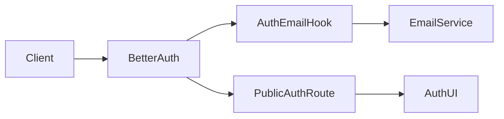
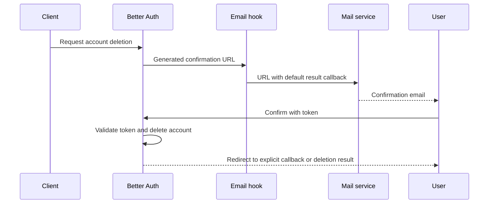

# Account deletion email results

Status: accepted

## Context and decision

A deletion email with `callbackURL=/` completes the operation, then sends the user to the API root without a result message.
The auth service owns the default result destination as permanent public behavior.
Before email delivery, it replaces an absent, empty, or `/` callback with its public `/auth/delete-account` route.
Explicit callback destinations remain unchanged. Better Auth keeps responsibility for token and callback validation.
The public route uses the configured Auth UI deployment and preserves environment routing.

## Scope

This change affects newly generated account deletion emails. It does not change existing emails, registration, token expiry, authorization, or data deletion.
The confirmation email remains required. The result page alone does not prove deletion.

## Dependencies



## Affected files

```text
server/apps/auth/src/
  auth.ts
  tests/auth.test.ts
server/docs/ai/adr/
  2026-10-09-account-deletion-email-result.md
```

## Sequence



## Verification

Hook tests capture the delivered URL and preserve its token and other query parameters.
Cases cover absent, empty, and root callbacks, plus explicit relative and absolute destinations.
Existing auth tests cover the deletion hook order. No production account deletion is part of these checks.
After deployment, request a new email with a disposable account and complete the flow on a physical device.
