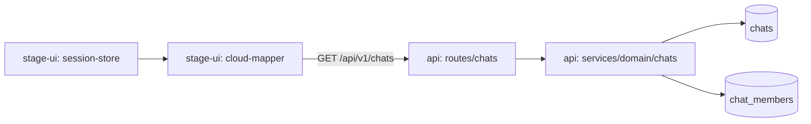
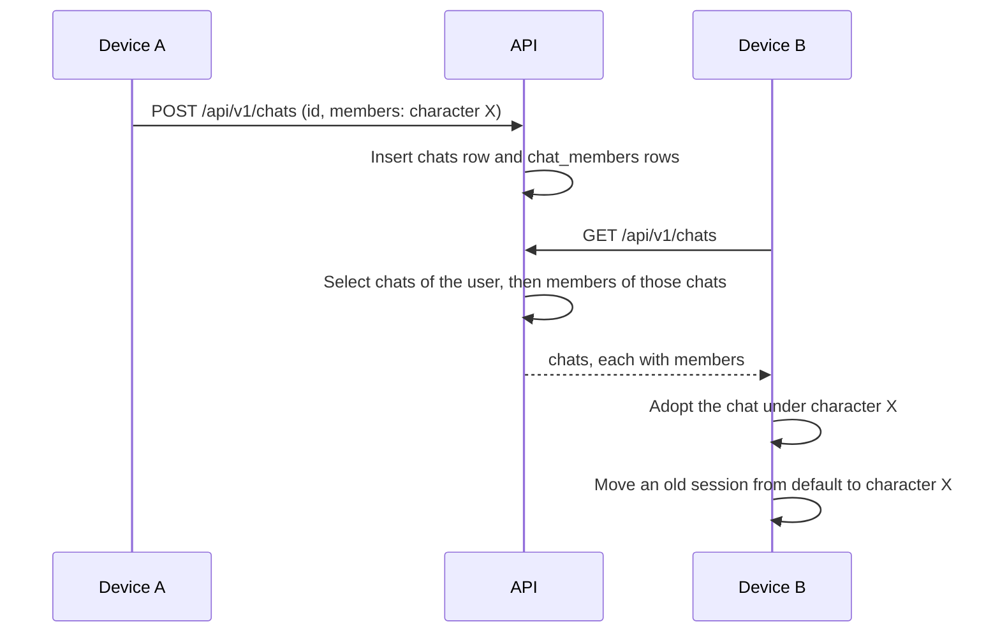

# The chat list includes the members of each chat

Status: proposed

## Context

A client sends the character of a chat when it creates the chat. `POST /api/v1/chats` stores it in `chat_members`.
`GET /api/v1/chats` returns only the rows of `chats`.
A second device then cannot tell which character a chat belongs to. It puts every received chat under the `default` character.
`GET /api/v1/chats/:id` returns the members, but one request for each chat is too slow for a reconcile.

`docs/ai/adr/2026-10-09-character-as-chat-member.md` gives the client design.

## Decision

- `GET /api/v1/chats` returns a `members` array for each chat.
- A member is a row of `chat_members`, the same shape that `GET /api/v1/chats/:id` returns.
- `listChats` reads the members of all listed chats with one more query. It does not query once for each chat.
- The client schema for a listed chat requires `members`. The response of `POST /api/v1/chats` stays without members.
- The client reads the character of a chat from the member with the `memberType` of `character`.
- A chat with no character member, or with many, has no single character. The client keeps it under `default`.
- The tables do not change. `chat_members` already holds many members for one chat, which a group chat needs.

## Scope

- The response of `GET /api/v1/chats`.
- `listChats` in the chat service.
- The response schema and the `adopt` step of the client.

## Non-goals

- A `character_id` column on `chats`. One column cannot hold the characters of a group chat.
- A check that `characterId` refers to a row of `character_cards`. Card synchronization is an optional experiment on each device.
- Changes to the routes that add or remove a member.
- Chats with many users.

## Module dependency graph



## Affected files

```text
server/apps/api/src/
├── services/domain/chats.ts        listChats returns members
└── services/domain/chats.test.ts   members in the list
packages/stage-ui/src/
├── libs/chat-sync/cloud-mapper.ts  listed chats require members, the plan gets a reassign list
└── stores/chat/session-store.ts    adopt and reassign use the character member
```

## Sequence



## Deployment

- Deploy the server before a client that requires `members`.
- An older client ignores the new property, so the server change is safe alone.

## Test plan

- `chats.test.ts`: the list returns the character member of each chat, and no chats of another user.
- `cloud-mapper.test.ts`: a response without `members` fails the parse.
- `cloud-mapper.test.ts`: the plan reassigns a session only when its remote chat has one other character.
- `session-store-lifecycle.browser.test.ts`: a received chat goes under the character of its member.
- The same test uses a character that the device does not have, and the id stays.
- `session-store-lifecycle.browser.test.ts`: a session under `default` moves to its character and keeps its messages.
