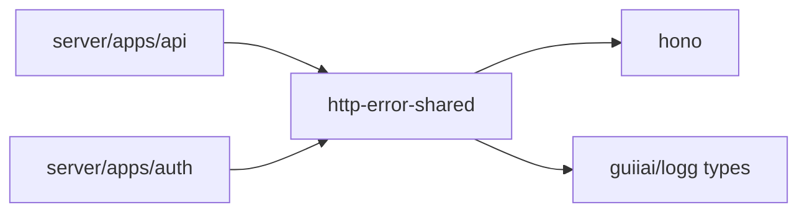
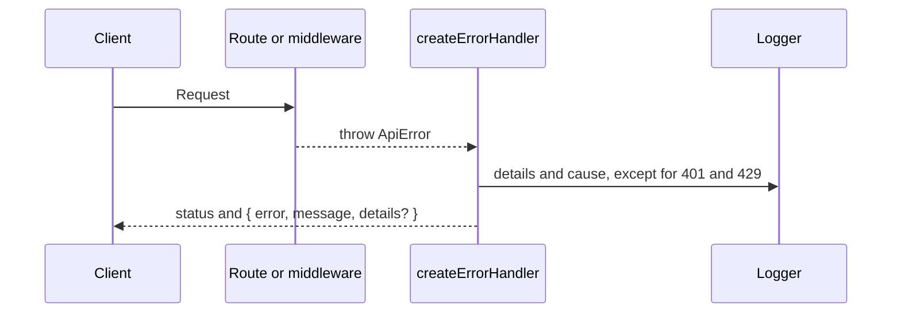

# Shared error response

Status: accepted

## Decision

The API service and the Auth service use one error model from `@proj-airi/http-error-shared`.
Each error response has the JSON body `{ error, message, details? }` and the HTTP status of the error.
Routes, middleware, and services throw an `ApiError`. Only the `onError` handler of the service writes the body.
A success response has no envelope. A route returns its resource directly.

The user confirmed this scope. Deployed clients must see no change in a response body.

## Scope

The two services had separate copies of `ApiError` and of the `onError` handler.
Five call sites wrote the error body by hand: the API body limit, both rate limiters, and two internal Auth routes.
These call sites now throw an `ApiError`, and the two copies become one package.

The handler does not log 401 and 429 errors. The rate limiter records each 429 response in a metric.
The Auth service now logs with the same messages as the API service: `API error occurred` and `Unhandled error`.
The logger name identifies the service.

Non-goals:

- A change to error code names, such as `email/send_failed`.
- A change to the error body of the OpenAI-compatible routes.
- A change to the shape of list responses.
- The Auth service body limit and 404 responses, which keep the Hono text defaults.
- The `ui` field of the API 404 response.

## Module dependencies



## Affected files

```text
server/packages/http-error-shared/
  src/error.ts        moved from server/apps/api/src/utils/error.ts
  src/handler.ts
  src/handler.test.ts
server/apps/api/
  Dockerfile
  production/railway/Dockerfile
  src/app.ts
  src/middlewares/rate-limit.ts
  src/routes/internal-auth.ts
  src/**              import path only
server/apps/auth/
  Dockerfile
  src/error.ts        deleted
  src/server.ts
  src/rate-limit.ts
  src/**              import path only
```

## Sequence



## Test plan

Run the handler tests for an `ApiError`, an unknown error, and an error from a middleware callback.
Check that a blocked request keeps its `RateLimit` headers and its JSON body.
Check the 400 body of the internal Auth route.
Run the API and Auth tests, the typecheck of each changed workspace, and lint.
Build the API and Auth Docker images, because CI does not build them.
