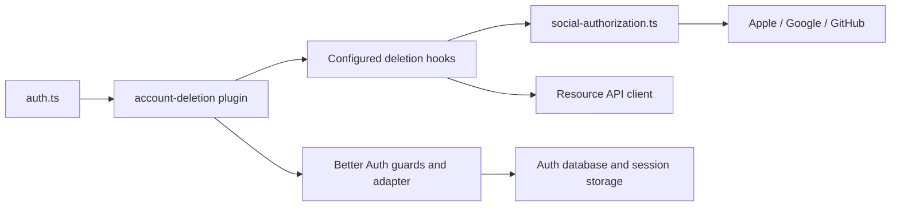
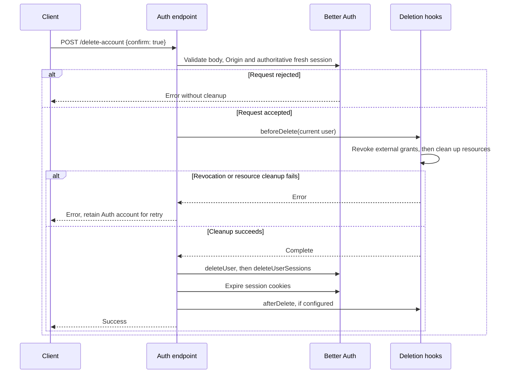

# Account deletion without email

Status: proposed

## Decision

Accounts with placeholder emails cannot receive deletion links.
Add `/api/auth/delete-account` with explicit `{ "confirm": true }` for in-app confirmation.
Keep `/delete-user` as a separate email-confirmed method so existing send-email prompts do not delete accounts immediately.

Without a deletion token, Better Auth's public `deleteUser` endpoint sends email when its verification hook is configured.
The new endpoint therefore uses the same native session guards, adapter methods, cookies, and configured deletion hooks.
It preserves the native deletion order without changing shared options or generating artificial email tokens.
Both session guards are necessary: the first requires database-backed authority, the second checks freshness.
Both adapter calls remain: `deleteUserSessions` also clears secondary session storage when configured.

## Architecture

### Module dependencies



Steam OpenID has no external grant. Its account still passes through resource cleanup and local deletion.

### Affected files

```text
server/
├── apps/auth/
│   ├── README.md
│   └── src/
│       ├── auth.ts
│       ├── social-authorization.ts
│       ├── plugins/account-deletion.ts
│       └── tests/
│           ├── account-deletion.test.ts
│           └── social-authorization.test.ts
└── docs/ai/adr/2026-10-10-account-deletion-confirmation.md
```

### Deletion sequence



## Security and failures

- The session selects the account. The strict body schema rejects target IDs and missing or false confirmation.
- JWTs require their own active original session. Token refresh cannot renew that session's creation time.
- Session freshness follows Better Auth configuration, currently 24 hours by default. Stale sessions require sign-in again.
- Browser cookies retain Origin checks. Native bearer requests use the same session authority and freshness rules.
- Steam uses OpenID 2.0 without an OAuth grant to revoke. Its local account and sessions still follow normal deletion.
- Provider revocation and resource cleanup run before Auth deletion. Failure preserves the account for retry.
- External cleanup and Auth deletion are not atomic. A retry can repeat completed cleanup, as in the existing flow.
- Success deletes the account and its sessions and expires cookies. A lost response requires account-state reconciliation.

## Verification and rollout

Handler tests use a real in-memory database, the production provider revoker, and external-service doubles.
They cover confirmation, authentication, freshness, JWT ownership, account isolation, Origin, retry, session invalidation, and unchanged email requests.
Deploy Auth before clients switch endpoints. Clients must update confirmation text, reauthentication, and success handling.
This PR changes no client UI, schema, or resource-retention policy.
Production deployment and physical-device acceptance require separate verification.
