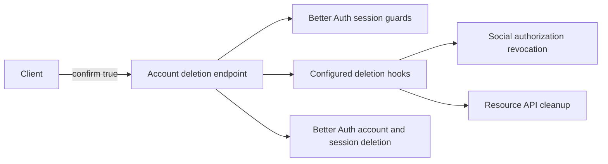
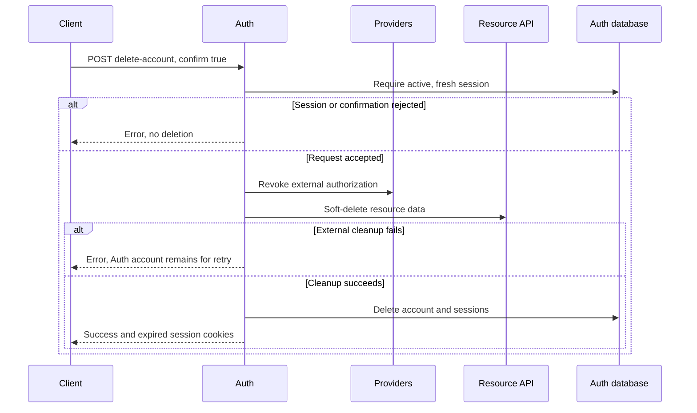

# Account deletion without email

Status: proposed

## Decision and scope

Add `POST /api/auth/delete-account` for clients that show a permanent-deletion confirmation.
The request body is `{ "confirm": true }`. The authenticated session identifies the account.
Require an authoritative session and Better Auth's configured session freshness check.
An old session returns `SESSION_NOT_FRESH`. The client must request sign-in before another deletion attempt.

Steam accounts use an email placeholder. These accounts cannot receive the current deletion email.
The new endpoint does not send email or accept a target user ID.
It calls the existing deletion hooks before deleting the Auth account and sessions.
External authorization revocation and resource cleanup keep their current order and failure behavior.

The email-confirmed `/delete-user` flow remains a supported deletion method.
It retains its existing meaning for clients that display a send-email confirmation.
Clients select one explicit method. There is no automatic fallback between methods.

## Non-goals

- No changes to the iOS or web confirmation screens in this PR.
- No database migration or changes to resource retention rules.
- No bypass of provider revocation, cleanup errors, or session freshness.

## Module dependencies



## Affected files

```text
server/apps/auth/
├── README.md
└── src/
    ├── auth.ts
    ├── plugins/account-deletion.ts
    └── tests/account-deletion.test.ts
```

## Sequence and failures



External cleanup and Auth deletion are not one transaction.
A partial failure can leave some external effects complete. Existing cleanup operations support retry.
Clients must show success only after a successful response. A lost response requires reconciliation of the account state.

## Test plan and rollout

Exercise the real Auth handler and an in-memory database with external cleanup doubles.
Cover placeholder email, ordinary email, missing confirmation, unauthorized requests, stale sessions, and external cleanup failures.
Check account isolation, session invalidation, retry, and unchanged email-confirmed deletion.
Run Auth tests, typecheck, and lint.

Deploy the server before clients use the new endpoint.
Update client confirmation text, stale-session recovery, and success handling before enabling that client flow.
Physical-device deletion and production deployment remain separate acceptance steps.
