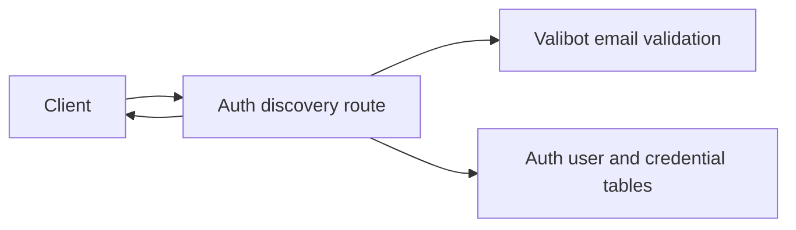
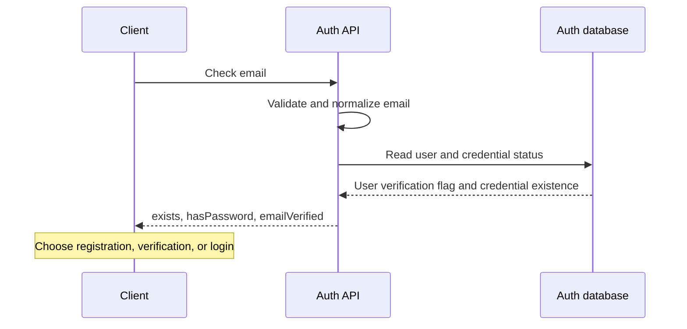

# Email verification in identifier discovery

Status: accepted

## Decision and scope

`POST /api/auth/check-email` returns `emailVerified` with the existing `exists` and `hasPassword` fields.
For existing users, the value comes from `user.emailVerified`. For unknown emails, it is false.
Clients use this value only for navigation. Password authentication remains authoritative and still checks verification.
The existing unauthenticated discovery endpoint and its rate limit remain in place.
This adds verification-state disclosure to its existing account-existence disclosure. No token, identity, password, or session is returned.
No schema migration, login bypass, email delivery change, or desktop UI change is included.

## Dependency graph



## Affected files

```text
server/apps/auth/src/
  routes.ts
  tests/routes-check-email.test.ts
server/docs/ai/adr/
  2026-10-10-email-verification-discovery.md
```

## Sequence



## Verification and rollout

Route tests cover unknown users, verified and unverified users, credential presence, and invalid inputs.
Deploy the service before the client. Clients can ignore the added field.
An absent client field means unknown verification status, not successful verification.
A client must not accept this response as proof of authentication.
