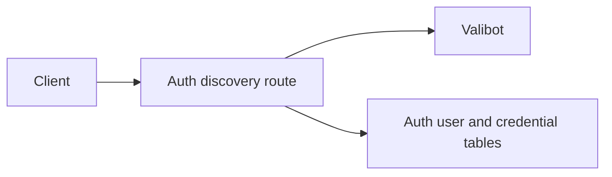
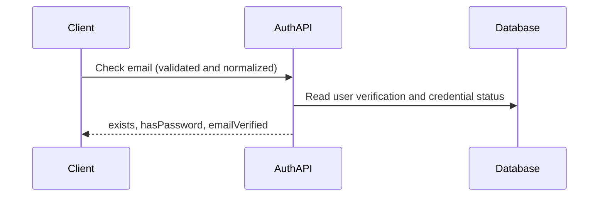

# Email verification in identifier discovery

Status: accepted

`POST /api/auth/check-email` adds `emailVerified` from `user.emailVerified` (false for unknown emails). It is a navigation hint, not authentication; an absent field means unknown status.
The existing public endpoint and rate limit remain. This exposes verification state alongside account existence; no migration, login bypass, or email delivery change is included.

The web sign-in page sends existing unverified users to `/verify-email` before password entry and preserves the OIDC continuation.
Supported policy: missing verification status keeps the existing login flow during independent deployments. Authentication still enforces verification.

## Dependencies and affected files



```text
server/
  apps/auth/src/{routes.ts,tests/routes-check-email.test.ts}
  docs/ai/adr/2026-10-10-email-verification-discovery.md
apps/ui-server-auth/src/{modules/email-password.ts,pages/sign-in.vue}
```

## Flow and verification



Route tests cover unknown users, both verification states, credential presence, and invalid input. Deploy the service first; older clients ignore the added field. Password authentication remains authoritative.
