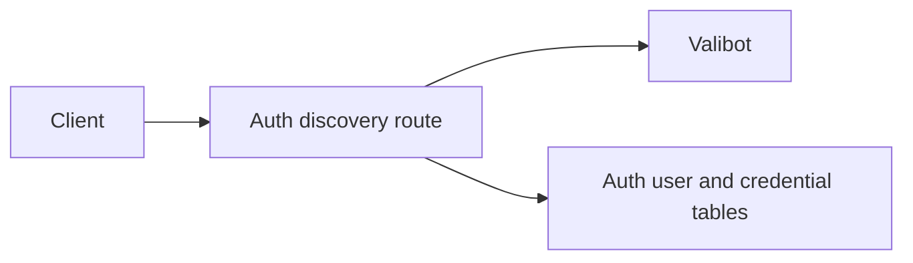
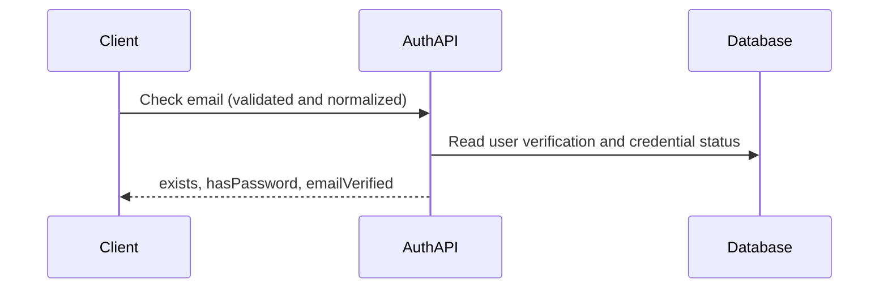

# Email verification in identifier discovery

Status: accepted

`POST /api/auth/check-email` adds `emailVerified` from `user.emailVerified` (false for unknown emails). It is a navigation hint, not authentication; an absent field means unknown status.
The existing public endpoint and rate limit remain. This exposes verification state alongside account existence; no migration, login bypass, email delivery, or desktop UI change is included.

## Dependencies and affected files



```text
server/
  apps/auth/src/{routes.ts,tests/routes-check-email.test.ts}
  docs/ai/adr/2026-10-10-email-verification-discovery.md
```

## Flow and verification



Route tests cover unknown users, both verification states, credential presence, and invalid input. Deploy the service first; older clients ignore the added field. Password authentication remains authoritative.
