# Memory System Workflow Diagram

## Complete Memory System Architecture

```mermaid
graph TB
    %% User Input
    User[👤 User Message] --> RawIngestion[📥 Raw Data Ingestion]

    %% Phase 1: Ingestion
    subgraph "Phase 1: Ingestion & Short-Term Storage"
        RawIngestion --> ChatMessages[💬 chatMessagesTable]
        RawIngestion --> Photos[📸 photosTable]
        RawIngestion --> Stickers[😀 stickersTable]

        ChatMessages --> Embeddings[🔢 Generate Embeddings]
        Photos --> Embeddings
        Stickers --> Embeddings

        Embeddings --> VectorStorage[💾 Store Vectors]
    end

    %% Phase 2: Consolidation Trigger
    VectorStorage --> ConsolidationTrigger[⏰ Background Consolidation Trigger]

    %% Phase 2: Memory Consolidation
    subgraph "Phase 2: Asynchronous Memory Consolidation"
        ConsolidationTrigger --> MemoryManager[🧠 LLM Memory Manager]

        MemoryManager --> Analysis[🔍 Content Analysis]
        Analysis --> Extraction[📋 Information Extraction]

        Extraction --> CoreMemory[💭 memoryFragmentsTable]
        Extraction --> EpisodicMemory[📅 memoryEpisodicTable]
        Extraction --> Tagging[🏷️ memoryTagsTable]
        Extraction --> Goals[🎯 memoryLongTermGoalsTable]
        Extraction --> Ideas[💡 memoryShortTermIdeas]

        %% Links between tables
        CoreMemory -.->|memory_id| EpisodicMemory
        CoreMemory -.->|memory_id| Tagging
        CoreMemory -.->|memory_id| Goals
        CoreMemory -.->|memory_id| Ideas
    end

    %% Phase 3: User Query
    UserQuery[❓ New User Query] --> Retrieval[🔍 Memory Retrieval]

    %% Phase 3: RAG Retrieval
    subgraph "Phase 3: Multi-Dimensional Retrieval (RAG)"
        Retrieval --> VectorSearch[🔢 Vector Similarity Search]
        Retrieval --> EpisodicFilter[📅 Episodic Filtering]
        Retrieval --> TagFilter[🏷️ Tag-Based Search]
        Retrieval --> GoalFilter[🎯 Goal Context]
        Retrieval --> IdeaFilter[💡 Idea Integration]

        VectorSearch --> CoreMemory
        EpisodicFilter --> EpisodicMemory
        TagFilter --> Tagging
        GoalFilter --> Goals
        IdeaFilter --> Ideas

        %% Context Assembly
        CoreMemory --> ContextAssembly[🧩 Context Assembly]
        EpisodicMemory --> ContextAssembly
        Tagging --> ContextAssembly
        Goals --> ContextAssembly
        Ideas --> ContextAssembly
        ChatMessages --> ContextAssembly
    end

    %% Phase 4: Response Generation
    ContextAssembly --> PromptConstruction[📝 Prompt Construction]
    PromptConstruction --> LLMResponse[🤖 LLM Response Generation]
    LLMResponse --> Response[💬 AI Response]

    %% Phase 5: Memory Updates
    Response --> UsageTracking[📊 Usage Tracking]
    UsageTracking --> MemoryUpdates[🔄 Memory Updates]
    MemoryUpdates --> CoreMemory

    %% Styling
    classDef userInput fill:#e1f5fe
    classDef storage fill:#f3e5f5
    classDef processing fill:#e8f5e8
    classDef output fill:#fff3e0

    class User,UserQuery userInput
    class ChatMessages,Photos,Stickers,CoreMemory,EpisodicMemory,Tagging,Goals,Ideas storage
    class RawIngestion,Embeddings,MemoryManager,Analysis,Extraction,Retrieval,VectorSearch,EpisodicFilter,TagFilter,GoalFilter,IdeaFilter,ContextAssembly,PromptConstruction,LLMResponse,UsageTracking,MemoryUpdates processing
    class Response output
```

## Detailed Memory Consolidation Flow

```mermaid
flowchart TD
    %% Input Sources
    subgraph "Input Sources"
        ChatMsg[💬 Chat Message]
        Photo[📸 Photo]
        Sticker[😀 Sticker]
    end

    %% LLM Analysis
    subgraph "LLM Memory Manager Analysis"
        ChatMsg --> Analysis[🔍 Content Analysis]
        Photo --> Analysis
        Sticker --> Analysis

        Analysis --> ExtractFacts[📋 Extract Facts]
        Analysis --> ExtractEvents[📅 Extract Events]
        Analysis --> ExtractEntities[🏷️ Extract Entities]
        Analysis --> ExtractGoals[🎯 Extract Goals]
        Analysis --> ExtractIdeas[💡 Extract Ideas]
    end

    %% Memory Classification
    subgraph "Memory Classification"
        ExtractFacts --> ClassifyType[🏷️ Classify Memory Type]
        ClassifyType --> Working[⚡ Working Memory]
        ClassifyType --> ShortTerm[📝 Short-Term Memory]
        ClassifyType --> LongTerm[💾 Long-Term Memory]
        ClassifyType --> Muscle[💪 Muscle Memory]
    end

    %% Storage Decision
    subgraph "Storage Decision"
        Working --> StoreWorking[💾 Store in Working]
        ShortTerm --> StoreShort[💾 Store in Short-Term]
        LongTerm --> StoreLong[💾 Store in Long-Term]
        Muscle --> StoreMuscle[💾 Store in Muscle]

        StoreWorking --> Consolidate[🔄 Consolidation Process]
        StoreShort --> Consolidate
        StoreLong --> Consolidate
        StoreMuscle --> Consolidate
    end

    %% Database Storage
    subgraph "Database Storage"
        Consolidate --> MemoryFragments[💭 memoryFragmentsTable]
        ExtractEvents --> Episodic[📅 memoryEpisodicTable]
        ExtractEntities --> Tags[🏷️ memoryTagsTable]
        ExtractGoals --> Goals[🎯 memoryLongTermGoalsTable]
        ExtractIdeas --> Ideas[💡 memoryShortTermIdeas]

        MemoryFragments -.->|memory_id| Episodic
        MemoryFragments -.->|memory_id| Tags
        MemoryFragments -.->|memory_id| Goals
        MemoryFragments -.->|memory_id| Ideas
    end

    %% Styling
    classDef input fill:#e3f2fd
    classDef analysis fill:#f1f8e9
    classDef classification fill:#fff3e0
    classDef storage fill:#fce4ec
    classDef database fill:#f3e5f5

    class ChatMsg,Photo,Sticker input
    class Analysis,ExtractFacts,ExtractEvents,ExtractEntities,ExtractGoals,ExtractIdeas analysis
    class ClassifyType,Working,ShortTerm,LongTerm,Muscle,StoreWorking,StoreShort,StoreLong,StoreMuscle,Consolidate classification
    class MemoryFragments,Episodic,Tags,Goals,Ideas database
```

## Memory Retrieval Flow

```mermaid
flowchart TD
    %% User Query
    UserQuery[❓ User Query] --> QueryAnalysis[🔍 Query Analysis]

    %% Multi-Dimensional Search
    subgraph "Multi-Dimensional Search"
        QueryAnalysis --> VectorSearch[🔢 Vector Similarity Search]
        QueryAnalysis --> EpisodicSearch[📅 Episodic Search]
        QueryAnalysis --> TagSearch[🏷️ Tag Search]
        QueryAnalysis --> GoalSearch[🎯 Goal Search]
        QueryAnalysis --> IdeaSearch[💡 Idea Search]

        VectorSearch --> MemoryFragments[💭 memoryFragmentsTable]
        EpisodicSearch --> EpisodicTable[📅 memoryEpisodicTable]
        TagSearch --> TagsTable[🏷️ memoryTagsTable]
        GoalSearch --> GoalsTable[🎯 memoryLongTermGoalsTable]
        IdeaSearch --> IdeasTable[💡 memoryShortTermIdeas]
    end

    %% Context Assembly
    subgraph "Context Assembly"
        MemoryFragments --> RankMemories[📊 Rank by Relevance]
        EpisodicTable --> RankMemories
        TagsTable --> RankMemories
        GoalsTable --> RankMemories
        IdeasTable --> RankMemories

        RankMemories --> FilterContext[🔍 Filter by Context]
        FilterContext --> AssembleContext[🧩 Assemble Final Context]
    end

    %% Response Generation
    AssembleContext --> PromptConstruction[📝 Construct Prompt]
    PromptConstruction --> LLM[🤖 LLM Processing]
    LLM --> Response[💬 Generate Response]

    %% Memory Updates
    Response --> UpdateUsage[📊 Update Usage Stats]
    UpdateUsage --> MemoryFragments

    %% Styling
    classDef query fill:#e1f5fe
    classDef search fill:#f3e5f5
    classDef assembly fill:#e8f5e8
    classDef response fill:#fff3e0

    class UserQuery,QueryAnalysis query
    class VectorSearch,EpisodicSearch,TagSearch,GoalSearch,IdeaSearch,MemoryFragments,EpisodicTable,TagsTable,GoalsTable,IdeasTable search
    class RankMemories,FilterContext,AssembleContext,PromptConstruction assembly
    class LLM,Response,UpdateUsage response
```

## Memory Types and Lifecycle

```mermaid
flowchart LR
    %% Memory Types
    subgraph "Memory Types"
        Working[⚡ Working Memory<br/>Seconds to minutes]
        ShortTerm[📝 Short-Term Memory<br/>Hours to days]
        LongTerm[💾 Long-Term Memory<br/>Months to years]
        Muscle[💪 Muscle Memory<br/>Permanent once learned]
    end

    %% Lifecycle Flow
    Working --> Consolidation{🔄 Consolidation Decision}
    ShortTerm --> Consolidation

    Consolidation -->|Important| LongTerm
    Consolidation -->|Not Important| Forget[🗑️ Forget]
    Consolidation -->|Behavioral Pattern| Muscle

    %% Reinforcement
    LongTerm --> Reinforcement{📈 Reinforcement}
    Reinforcement -->|Frequently Accessed| Strengthen[💪 Strengthen Memory]
    Reinforcement -->|Rarely Accessed| Weaken[📉 Weaken Memory]

    Strengthen --> LongTerm
    Weaken --> Forget

    %% Styling
    classDef memoryTypes fill:#e3f2fd
    classDef decision fill:#fff3e0
    classDef action fill:#f1f8e9

    class Working,ShortTerm,LongTerm,Muscle memoryTypes
    class Consolidation,Reinforcement decision
    class Forget,Strengthen,Weaken action
```

## Database Schema Relationships

