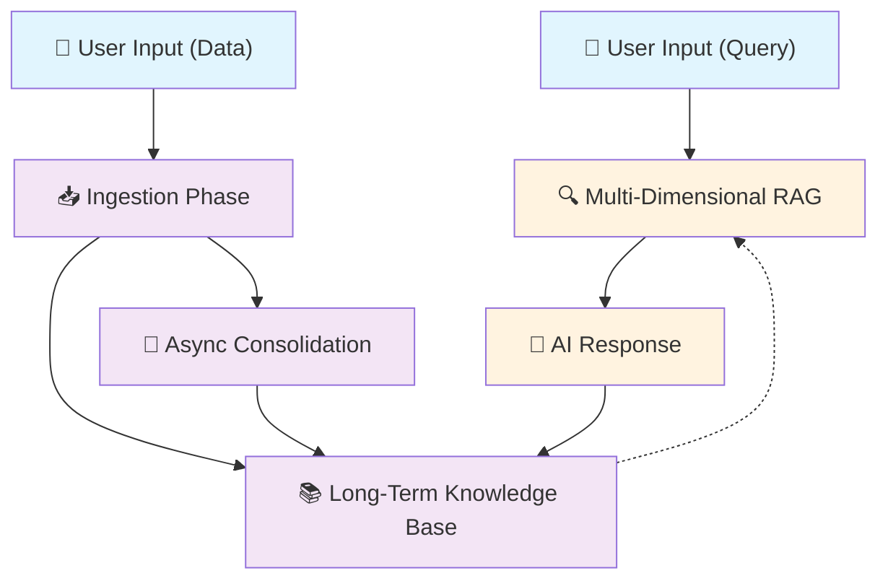
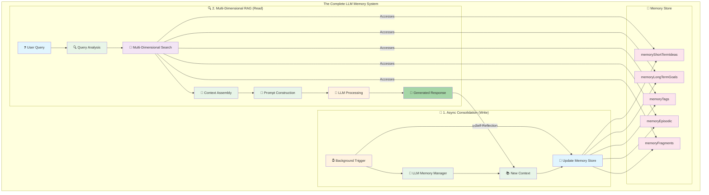
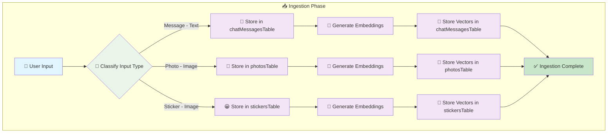
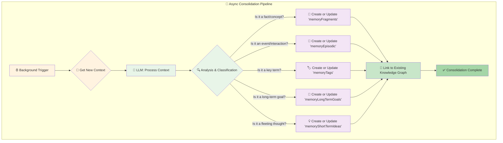

# Memory System Workflow - Phase Breakdown

## General Overview

```mermaid
graph TD
    A["👤 User Input (Query)"] --> B["🔍 Multi-Dimensional RAG"]
    B --> C["🤖 AI Response"]

    D["👤 User Input (Data)"] --> E["📥 Ingestion Phase"]
    E --> F["📚 Long-Term Knowledge Base"]
    E --> G["🔄 Async Consolidation"]

    G --> F
    F -.-> B

    C --> F

    style A fill:#e1f5fe
    style B fill:#fff3e0
    style C fill:#fff3e0
    style D fill:#e1f5fe
    style E fill:#f3e5f5
    style F fill:#f3e5f5
    style G fill:#f3e5f5
```

## Complete System Overview

```mermaid
flowchart TD
    subgraph "The Complete LLM Memory System"
        direction LR
        subgraph "🔄 1. Async Consolidation (Write)"
            A[⏰ Background Trigger] --> B[🧠 LLM Memory Manager]
            B --> C[📚 New Context]
            C --> D[💾 Update Memory Store]
        end

        subgraph "🧠 Memory Store"
            D1[memoryFragments]
            D2[memoryEpisodic]
            D3[memoryTags]
            D4[memoryLongTermGoals]
            D5[memoryShortTermIdeas]
        end

        subgraph "🔍 2. Multi-Dimensional RAG (Read)"
            E[❓ User Query] --> F[🔍 Query Analysis]
            F --> G[🔎 Multi-Dimensional Search]
            G --> H[🧩 Context Assembly]
            H --> I[📝 Prompt Construction]
            I --> J[🤖 LLM Processing]
            J --> K[💬 Generated Response]
        end

        A -- "Initial Data" --> D
        D --> D1
        D --> D2
        D --> D3
        D --> D4
        D --> D5

        G -- "Accesses" --> D1
        G -- "Accesses" --> D2
        G -- "Accesses" --> D3
        G -- "Accesses" --> D4
        G -- "Accesses" --> D5

        K -- "Self-Reflection" --> C
        style K fill:#c8e6c9

        style A fill:#fff3e0
        style B fill:#e8f5e8
        style C fill:#e8f5e8
        style D fill:#e1f5fe
        style E fill:#e1f5fe
        style F fill:#e8f5e8
        style G fill:#f3e5f5
        style H fill:#e8f5e8
        style I fill:#e8f5e8
        style J fill:#fff3e0
        style K fill:#a5d6a7
        style D1 fill:#fce4ec
        style D2 fill:#fce4ec
        style D3 fill:#fce4ec
        style D4 fill:#fce4ec
        style D5 fill:#fce4ec
    end
```

## Phase 1: Ingestion Phase

```mermaid
flowchart TD
    subgraph "📥 Ingestion Phase"
        A[👤 User Input] --> B{📄 Classify Input Type}

        B -->|Message - Text| C1[💬 Store in chatMessagesTable]
        B -->|Photo - Image| C2[📸 Store in photosTable]
        B -->|Sticker - Image| C3[😀 Store in stickersTable]

        C1 --> D1[🔢 Generate Embeddings]
        C2 --> D2[🔢 Generate Embeddings]
        C3 --> D3[🔢 Generate Embeddings]

        D1 --> E1[💾 Store Vectors in chatMessagesTable]
        D2 --> E2[💾 Store Vectors in photosTable]
        D3 --> E3[💾 Store Vectors in stickersTable]

        E1 --> F[✅ Ingestion Complete]
        E2 --> F
        E3 --> F
    end

    style A fill:#e1f5fe
    style B fill:#e8f5e8
    style C1 fill:#f3e5f5
    style C2 fill:#f3e5f5
    style C3 fill:#f3e5f5
    style D1 fill:#f3e5f5
    style D2 fill:#f3e5f5
    style D3 fill:#f3e5f5
    style E1 fill:#f3e5f5
    style E2 fill:#f3e5f5
    style E3 fill:#f3e5f5
    style F fill:#c8e6c9
```

## Phase 2: Async Consolidation

```mermaid
graph TD
    subgraph "🔄 Async Consolidation Pipeline"
        A[⏰ Background Trigger] --> B{📄 Get New Context}

        B --> C[🧠 LLM: Process Context]

        C --> D{🔍 Analysis & Classification}

        D -- "Is it a fact/concept?" --> E[💭 Create or Update 'memoryFragments']
        D -- "Is it an event/interaction?" --> F[📅 Create or Update 'memoryEpisodic']
        D -- "Is it a key term?" --> G[🏷️ Create or Update 'memoryTags']
        D -- "Is it a long-term goal?" --> H[🎯 Create or Update 'memoryLongTermGoals']
        D -- "Is it a fleeting thought?" --> I[💡 Create or Update 'memoryShortTermIdeas']

        E --> J[🔗 Link to Existing Knowledge Graph]
        F --> J
        G --> J
        H --> J
        I --> J

        J --> K[✅ Consolidation Complete]
    end

    style A fill:#fff3e0
    style B fill:#fff3e0
    style C fill:#e8f5e8
    style D fill:#e8f5e8
    style E fill:#f3e5f5
    style F fill:#f3e5f5
    style G fill:#f3e5f5
    style H fill:#f3e5f5
    style I fill:#f3e5f5
    style J fill:#c8e6c9
    style K fill:#a5d6a7
```

## Phase 3: Multi-Dimensional RAG

```mermaid
flowchart TD
    subgraph "🔍 Multi-Dimensional RAG"
        A[❓ User Query] --> B[🔍 Query Analysis]

        B --> C[🔢 Vector Similarity Search]
        B --> D[📅 Episodic Filtering]
        B --> E[🏷️ Tag-Based Search]
        B --> F[🎯 Goal Context]
        B --> G[💡 Idea Integration]

        C --> H[💭 Search memoryFragments]
        D --> I[📅 Search memoryEpisodic]
        E --> J[🏷️ Search memoryTags]
        F --> K[🎯 Search memoryLongTermGoals]
        G --> L[💡 Search memoryShortTermIdeas]

        H --"retrieved chunks"--> M[🧩 Context Assembly]
        I --"retrieved events"--> M
        J --"retrieved tags"--> M
        K --"retrieved goals"--> M
        L --"retrieved ideas"--> M

        subgraph "🧩 Context Assembly"
            M --> M1{⚙️ Relevancy & Redundancy Filtering}
            M1 --> M2{⚖️ Conflict Resolution & Prioritization}
            M2 --> M3[🧠 LLM: Synthesize Context]
        end

        M3 --> N[📝 Prompt Construction]
        N --> O[🤖 LLM Processing]
        O --> P[💬 Generate Response]

        P --> Q[📊 Update Usage Stats]
        Q --> R[✅ RAG Complete]
    end

    style A fill:#e1f5fe
    style B fill:#e8f5e8
    style C fill:#f3e5f5
    style D fill:#f3e5f5
    style E fill:#f3e5f5
    style F fill:#f3e5f5
    style G fill:#f3e5f5
    style H fill:#fce4ec
    style I fill:#fce4ec
    style J fill:#fce4ec
    style K fill:#fce4ec
    style L fill:#fce4ec
    style M fill:#e8f5e8
    style M1 fill:#e8f5e8
    style M2 fill:#e8f5e8
    style M3 fill:#c8e6c9
    style N fill:#e8f5e8
    style O fill:#fff3e0
    style P fill:#fce4ec
    style Q fill:#e8f5e8
    style R fill:#a5d6a7
```
