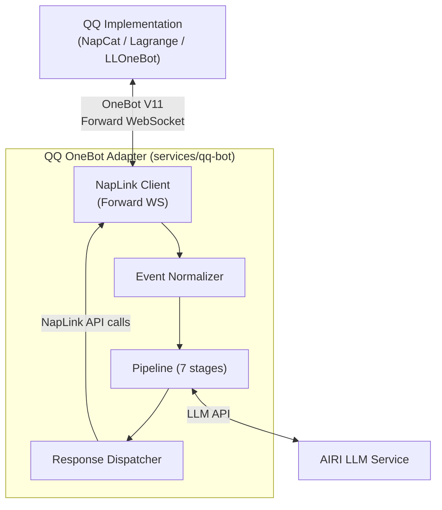
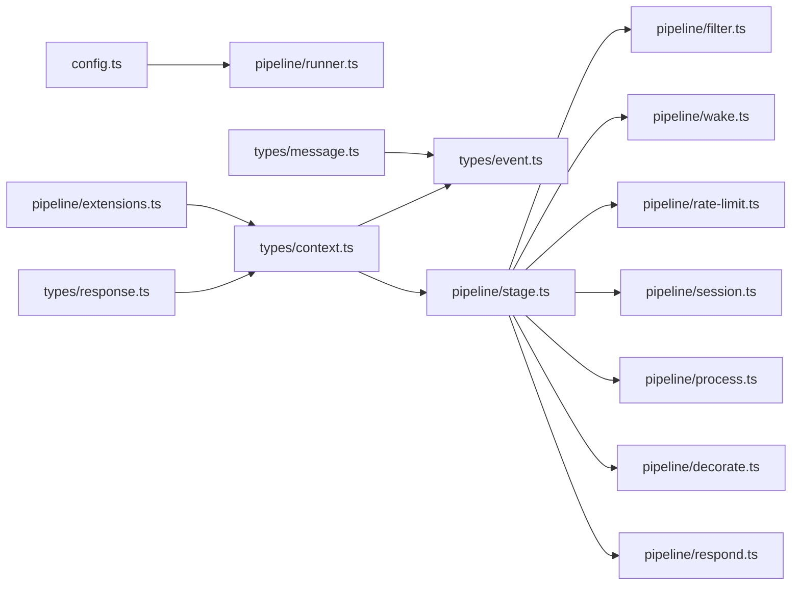

# Project AIRI — QQ OneBot Adapter

> QQ platform adapter for [Project AIRI](https://github.com/moeru-ai/airi) (⭐ 34.6K), based on OneBot V11 protocol. Connects to NapCat via forward WebSocket using NapLink SDK, with a 7-stage pipeline architecture.
>

---

## Table of Contents

- [Features](#features)
- [Architecture Overview](#architecture-overview)
- [Pipeline Stages](#pipeline-stages)
- [Quick Start (Foolproof Setup)](#quick-start-foolproof-setup)
- [Configuration Reference](#configuration-reference)
- [Project Structure](#project-structure)
- [Type Architecture](#type-architecture)
- [Development](#development)

---

## Features

- **OneBot V11** protocol via NapLink SDK (typed, auto-reconnect, heartbeat)
- **7-stage pipeline**: Filter → Wake → RateLimit → Session → Process → Decorate → Respond
- **Rule-first, LLM-last**: pre-filtering saves tokens
- **Config-driven**: all behaviors in one YAML, supports hot-reload
- **Adapter-only**: protocol translation only; business logic lives in the pipeline
- **QQ-native**: groups, private chats, poke, @mention, reply — all first-class

---

## Architecture Overview



### Four Core Modules

1. **NapLink Client** — Protocol connection layer. Manages forward WebSocket with built-in heartbeat, exponential backoff reconnect, and API timeout control.
2. **Event Normalizer** — Maps NapLink's hierarchical event callbacks (`message.group`, `notice.notify.poke`, etc.) into a unified `QQMessageEvent`.
3. **Pipeline** — Configurable 7-stage chain. Messages flow through each stage sequentially.
4. **Response Dispatcher** — Calls NapLink's wrapped API methods (`client.sendGroupMessage()`, `client.sendPrivateMessage()`) to send responses.

---

## Pipeline Stages


| Stage | Responsibility |
| --- | --- |
| **① Filter** | Drop noise: system bots (QQ Manager), blacklists, whitelist mode, empty/emoji-only messages |
| **② Wake** | Decide if bot should respond: private chat, @bot, reply, keyword, or random |
| **③ RateLimit** | Prevent spam: per-session, per-user, global sliding windows + cooldown |
| **④ Session** | Maintain per-session message history ring buffer for LLM context |
| **⑤ Process** | Core logic: built-in commands → plugin hooks → LLM via `@xsai/generate-text` |
| **⑥ Decorate** | Post-process LLM output: split long messages, Markdown → QQ format, content filter |
| **⑦ Respond** | Send via NapLink API with simulated typing delay and retry |

Each stage returns one of:

- `{ action: 'continue' }` — proceed to next stage
- `{ action: 'skip' }` — abort silently, no reply
- `{ action: 'respond', payload }` — send response immediately and stop

---

## Quick Start (Foolproof Setup)

### Prerequisites

- Node.js ≥ 20
- A running [NapCat](https://github.com/NapNeko/NapCatQQ) instance with forward WebSocket enabled
- An OpenAI-compatible LLM API endpoint

### Step 1 — Clone & Install

```bash
git clone https://github.com/moeru-ai/airi.git
cd airi/services/qq-bot
npm install
```

### Step 2 — Configure NapCat

In NapCat's web UI or config file, enable **forward WebSocket** and note the address (default: `ws://localhost:3001`).

If you set an access token in NapCat, note it down.

### Step 3 — Create Your Config File

Copy the example config:

```bash
cp config.example.yaml config.yaml
```

Then open `config.yaml` and fill in the **three required fields**:

```yaml
# ① NapCat WebSocket address
naplink:
  connection:
    url: 'ws://localhost:3001' # ← change this to your NapCat address
    token: 'your_token_here' # ← remove this line if no token set

# ② AIRI server
airi:
  url: 'ws://localhost:6121/ws' # ← your AIRI server WebSocket address
  token: 'your-airi-token' # ← remove this line if no token required

# ③ Wake words (how to trigger the bot in group chats)
wake:
  keywords:
    - 'airi'
    - '爱莉'
```

Everything else has sensible defaults — you don't need to touch it.

### Step 4 — Set Environment Variables (Alternative to YAML)

If you prefer not to hardcode values in YAML, use environment variables with your deployment/template tooling:

```bash
export AIRI_URL="ws://localhost:6121/ws"
export AIRI_TOKEN="your-airi-token"
```

Then reference them in your `config.yaml` values.

### Step 5 — Run

```bash
npm run start
# or for development with auto-reload:
npm run dev
```

You should see:

```
[12:00:00.000] [INFO ] [naplink] Connected to ws://localhost:3001
[12:00:00.123] [INFO ] [index ] Bot QQ: 123456789
[12:00:00.124] [INFO ] [index ] Pipeline ready with 7 stages
```

### Step 6 — Test It

- **Private chat**: send any message to the bot QQ → bot replies
- **Group chat**: @bot or say a keyword → bot replies
- **Built-in commands**: `/help`, `/status`, `/clear`

---

## Configuration Reference

### `naplink` — Connection

```yaml
naplink:
  connection:
    url: 'ws://localhost:3001' # NapCat WS address (required)
    token: '' # Access token (optional)
    timeout: 30000 # Connection timeout ms
    pingInterval: 30000 # Heartbeat interval ms (0 = disable)
  reconnect:
    enabled: true
    maxAttempts: 10
    backoff:
      initial: 1000
      max: 60000
      multiplier: 2
  api:
    timeout: 30000
    retries: 3
```

### `filter` — Message Filtering

```yaml
filter:
  blacklistUsers: [] # QQ numbers to always ignore
  blacklistGroups: [] # Group IDs to always ignore
  whitelistMode: false # If true, only respond in whitelistGroups
  whitelistGroups: []
  ignoreSystemUsers: # Auto-filtered system bots
    - '2854196310' # QQ Manager (default)
  ignoreEmptyMessages: true # Filter pure-emoji / empty messages
```

### `wake` — Wake Conditions

```yaml
wake:
  keywords: ['airi', '爱莉'] # Trigger keywords
  keywordMatchMode: 'contains' # "prefix" | "contains" | "regex"
  randomWakeRate: 0.05 # 0~1, random group chat wake probability
  alwaysWakeInPrivate: true # Always respond in private chat
```

**Wake priority** (highest → lowest):

1. Private chat message
2. @bot
3. Reply to bot message
4. Keyword match
5. Random (group only)

### `rateLimit` — Rate Limiting

```yaml
rateLimit:
  perSession:
    max: 10
    windowMs: 60000 # 10 messages per minute per group/chat
  perUser:
    max: 20
    windowMs: 60000
  global:
    max: 100
    windowMs: 60000
  cooldownMs: 2000 # Post-reply cooldown
  onLimited: 'silent' # "silent" | "notify"
  notifyMessage: '慢一点嘛～' # Used when onLimited = notify
```

### `session` — Context Window

```yaml
session:
  maxHistoryPerSession: 50 # Ring buffer size per session
  contextWindow: 20 # How many messages to send to LLM
  timeoutMs: 1800000 # Session timeout (30 min)
  isolateByTopic: false # QQ channel topic isolation (reserved)
```

### `process` — Core Processing

```yaml
process:
  commands:
    prefix: '/'
    enabled: ['help', 'status', 'clear']
  replyTimeoutMs: 120000
  sendMaxRetries: 5
```

### `airi` — AIRI Server Connection

```yaml
airi:
  url: 'ws://localhost:6121/ws'
  token: '' # Optional
```

### `decorate` — Response Post-processing

```yaml
decorate:
  maxMessageLength: 4500 # Split messages longer than this
  splitStrategy: 'multi-message' # "truncate" | "multi-message"
  autoReply: true # Quote the original message
  contentFilter:
    enabled: false
    replacements: {} # e.g. {"badword": "***"}
```

### `respond` — Sending

```yaml
respond:
  typingDelay:
    min: 300 # Simulate typing delay range (ms)
    max: 1200
  multiMessageDelay: 500 # Gap between multi-message sends
  retryCount: 2
  retryDelayMs: 1000
```

### `logging` — Global Log Level

```yaml
logging:
  level: 'info' # "debug" | "info" | "warn" | "error" | "off"
```

---

## Project Structure

```
services/qq-bot/
├── src/
│   ├── index.ts                       # Entry: init NapLink → register events → connect
│   ├── config.ts                      # Config types + Valibot schema + loader
│   ├── client.ts                      # NapLink instance lifecycle
│   ├── types/
│   │   ├── index.ts                   # Barrel export
│   │   ├── context.ts                 # PipelineContext, WakeReason, StageResult
│   │   ├── event.ts                   # QQMessageEvent, EventSource, buildSessionId
│   │   ├── message.ts                 # MessageSegment discriminated union + utils
│   │   └── response.ts                # ResponsePayload + factory functions
│   ├── normalizer/
│   │   └── index.ts                   # NapLink event data → QQMessageEvent
│   ├── dispatcher/
│   │   └── index.ts                   # Calls NapLink API to send responses
│   ├── pipeline/
│   │   ├── extensions.ts              # PipelineExtensions (shared stage data)
│   │   ├── runner.ts                  # Pipeline execution engine
│   │   ├── stage.ts                   # Abstract base class (timing + logging)
│   │   ├── filter.ts                  # ① FilterStage
│   │   ├── wake.ts                    # ② WakeStage
│   │   ├── rate-limit.ts              # ③ RateLimitStage
│   │   ├── session.ts                 # ④ SessionStage
│   │   ├── process.ts                 # ⑤ ProcessStage
│   │   ├── decorate.ts                # ⑥ DecorateStage
│   │   └── respond.ts                 # ⑦ RespondStage
│   ├── commands/
│   │   ├── index.ts                   # Command registry
│   │   ├── help.ts
│   │   ├── status.ts
│   │   └── clear.ts
│   └── utils/
│       ├── logger.ts                  # Unified logger (two-phase init + registry)
│       ├── naplink-logger-adapter.ts  # Adapts LoggerInstance to NapLink Logger
│       ├── message-buffer.ts          # Generic ring buffer (O(1) push/pop)
│       └── rate-limiter.ts            # Sliding window limiter + cooldown tracker
├── config.example.yaml
├── package.json
└── tsconfig.json
```

---

## Type Architecture

### Key Design Decisions

**1. MessageSegment as discriminated union**

All 9 segment types (`text`, `image`, `at`, `reply`, `face`, `file`, `voice`, `forward`, `poke`) are strongly typed. Switch on `seg.type` to narrow automatically.

**2. PipelineStage as abstract class**

Base class handles timing and logging via the `run()` template method. Subclasses only implement `execute()`.

**3. Config via Valibot schema**

One schema = TypeScript types + runtime validation + default values. No interface/validator drift.

**4. Input vs Output message segments**

- `InputMessageSegment` (includes `ReplySegment`) — used in `event.chain` and session history
- `OutputMessageSegment` (excludes `ReplySegment`) — used in `ResponsePayload`
- `ReplySegment` is injected by the Dispatcher from `response.replyTo`, never from stages

**5. Circular dependency elimination**

`PipelineContext`, `WakeReason`, and `StageResult` live in `types/context.ts`, breaking the `event.ts ↔ stage.ts` cycle.

**6. Two-phase logger initialization**

`createLogger('ns')` is safe to call at import time (uses default `info` level). Call `initLoggers(config)` after config loads to update all registered instances — including hot-reload.

### Dependency Flow



---

## Development

### Built-in Commands

| Command | Description |
| --- | --- |
| `/help` | Show available commands |
| `/status` | Show pipeline status and config summary |
| `/clear` | Clear current session history |

### Adding a Custom Stage

1. Create `src/pipeline/my-stage.ts` extending `PipelineStage`
2. Implement `execute(event): Promise<StageResult>`
3. Register in `pipeline/runner.ts` constructor

```ts
export class MyStage extends PipelineStage {
  readonly name = 'MyStage'
  constructor(private readonly config: MyConfig) {
    super()
    this.initLogger()
  }

  async execute(event: QQMessageEvent): Promise<StageResult> {
    // your logic here
    return { action: 'continue' }
  }
}
```

### Logging

```ts
import { createLogger } from './utils/logger'

const logger = createLogger('my-module')
logger.debug('detailed info')
logger.info('normal info')
logger.warn('something odd')
logger.error('something broke', error)
```

Set `NO_COLOR=1` to disable colored output (e.g. in CI/CD).

### Environment Variables

| Variable | Purpose |
| --- | --- |
| `AIRI_URL` | AIRI server WebSocket URL |
| `AIRI_TOKEN` | AIRI server token |
| `NO_COLOR` | Disable ANSI color output |

---

## Acknowledgements

The 7-stage pipeline architecture is heavily inspired by (read: shamelessly borrowed from) [AstrBot](https://github.com/Soulter/AstrBot). AstrBot is a fully-featured, elegantly architected multi-platform LLM bot framework — our pipeline is essentially a QQ OneBot-specific simplified edition of theirs.

Huge thanks to the AstrBot team and contributors for their open-source work 🙏

---

## License

MIT — see [AIRI main repo](https://github.com/moeru-ai/airi) for details.
