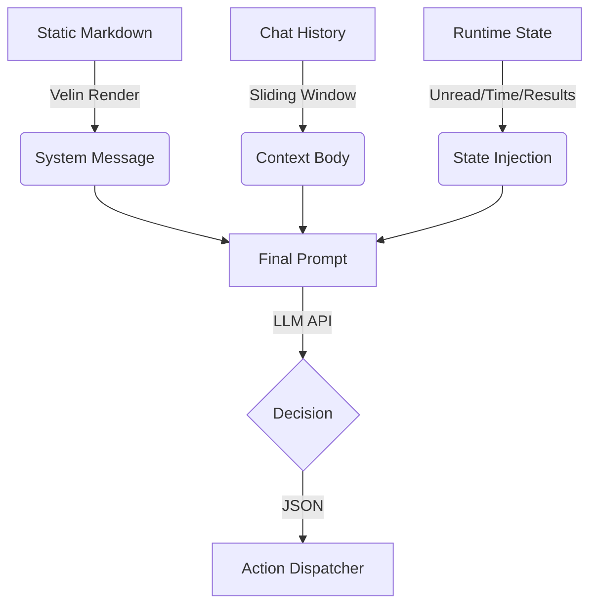

### **Prompt Architecture: Context-Injected Action Loop**

The bot implements a **"State-Aware Agentic Loop"** rather than a simple Chat-QA structure. The prompt is constructed dynamically at every tick of the loop.

#### **1. Static Layer (System Definitions)**

* **Source:** `src/core/planner/prompts/*.velin.md`
* **Loader:** `src/core/planner/prompts/index.ts`
* **Role:** Defines the "Soul" and "Rules".
* **Components:**
    * **Protocol Definition (`system-action-gen-v1`):** Hardcodes the JSON schema for available tools (`send_message`, `read_unread_messages`, `sleep`) and logic flow (e.g., "Must check unread messages after sending").
    * **Persona (`personality-v1`):** Defines the character "AIRI" (tone, brevity, naturalness).

#### **2. History Layer (Short-term Memory)**

* **Source:** In-memory `messages` array (`ChatContext`).
* **Role:** Provides conversational continuity.
* **Mechanism:** A sliding window of the last ~20 messages (User/Assistant turns) is injected directly after the system prompt.

#### **3. Dynamic State Layer (Sensory Injection)**

* **Source:** `src/core/planner/llm-client.ts` (Runtime generated)
* **Role:** Provides "Situational Awareness" and "Grounding".
* **Mechanism:** A synthesized **User Message** is appended at the very end of the context window, forcing the LLM to focus on the immediate reality. It contains:
    * **Incoming Stream**: Raw content of new messages arriving *now* (passed from `scheduler`).
    * **Action History**: Results of the *immediately preceding* tool executions (e.g., "Action: send_message, Result: Success").
    * **Environment**: Current server time.
    * **Global State**: A summary of unread message counts across all channels (`unreadEvents`).
    * **Trigger**: The final instruction: *"Based on the context... Respond with the action... in JSON only."*

---

### **Data Flow Summary**

### **Key Characteristics**

1. **JSON Enforcement**: The bot does not use native "Function Calling" APIs (like OpenAI Tools). It relies on **Prompt Engineering** to force the model to output raw JSON, which is then parsed by `best-effort-json-parser`.
2. **Stateless Logic**: The prompt explicitly tells the LLM "You have X unread messages" in every turn, making the LLM the sole decision-maker for flow control (Reading vs. Replying vs. Sleeping).
3. **Observation-Reflection**: The prompt includes `History actions`, allowing the LLM to "see" the result of its previous attempt (e.g., if a read action returned empty, it knows to stop).
